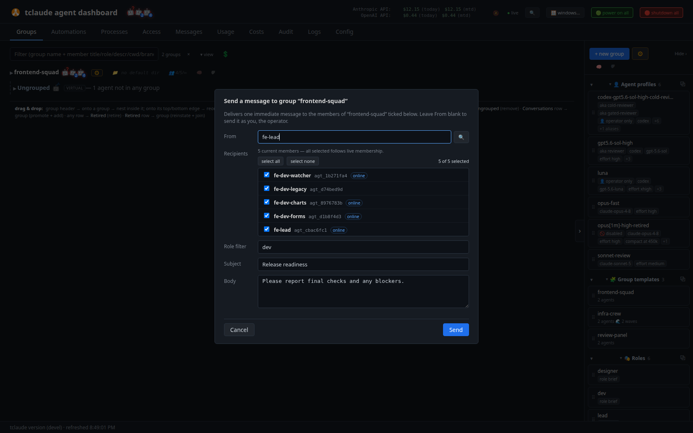
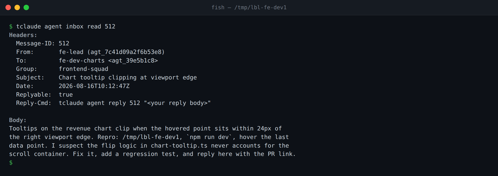

# Agents and groups

An **agent** is a conversation registered with the `agentd` daemon: it has a
stable identity, belongs to groups, and can exchange mail with its peers and
the operator. This page covers the daemon in brief, how identity works, what
groups are, and how messaging behaves. Spawning new agents and managing their
lifecycle is on [Spawning and lifecycle](spawning-and-lifecycle.md); the
permission model those features gate on is on
[Permissions and audit](permissions-and-audit.md).

## The agentd daemon

`tclaude agent` is a thin client. Everything it does — identity resolution,
permission gating, message delivery, spawning — routes through `tclaude
agentd`, a long-running daemon that owns the SQLite database at
`~/.tclaude/data/db.sqlite` and the tmux nudges into agent panes. Nothing
under `tclaude agent` works without it: the CLI deliberately refuses to fall
back to direct database access when the daemon is down, so killing the daemon
never bypasses authorization. Fail-closed is the design, not an accident.

Start it in a non-sandboxed shell (it needs the tmux socket and the
database):

```bash
tclaude agentd serve
```

It also ships as a standalone binary, `tclaude-agentd`, with the same code
and flags (`go install . ./cmd/...` builds both). Keep `tclaude` on `PATH`
next to it — the daemon forks `tclaude session new` to spawn agents. The
daemon runs in the foreground; restart it after upgrading tclaude, because
the CLI and daemon share an evolving request schema and an old daemon
silently drops request fields it does not know.

Agents reach the daemon over a Unix socket, canonically
`~/.tclaude/api/agentd-socket/agentd.sock` — kept outside `~/.tclaude/data/` so sandbox
profiles can deny the private data tree while leaving the socket reachable.
The human additionally gets a loopback HTTP listener on a random port for
the [dashboard](dashboard.md) and human-approval popups (`--dashboard-port`
pins it; a taken configured port fails startup rather than falling back).

The CLI is resilient to daemon restarts: connections retry with backoff,
and mutating requests carry a stable request ID that the daemon records in a
request-outcome ledger, so a retried request replays the completed response
instead of mutating twice.

Daemon-side configuration lives under `agent.*` keys in
`~/.tclaude/data/config.json`.

!!! note
    Some CLI help text still points at `~/.tclaude/config.json`. The real
    path is `~/.tclaude/data/config.json`.

For the full architectural model — what state lives where and how the
pieces relate — see [Architecture](architecture.md).

## Identity: who is calling

The daemon authenticates every request without tokens for agents. It reads
the connecting process's PID from the kernel (Unix socket peer
credentials), then walks the host process tree looking for a recognized
harness runtime — `claude`, `codex`, `copilot`, or Claude Code's `node`.
Recognition uses the process name or the kernel-reported executable path
(`/proc/<pid>/exe`), because `argv[0]` and the comm name are spoofable.

Every request lands on one of three verdicts:

- **Agent** — a harness ancestor was found. The daemon resolves which
  conversation the process belongs to and maps it to a stable **agent id**
  (`agt_…`) that survives `/clear` conversation rotation and
  [reincarnation](spawning-and-lifecycle.md#reincarnate). Agent requests
  pass through the [permission model](permissions-and-audit.md).
- **Human** — no harness ancestor, plus a valid operator token (or the
  cookie-authenticated dashboard). The human bypasses every permission
  gate.
- **Refused** — anything else. There is no "assume human" path.

The operator token (`tclo_` prefix) is minted fresh at each daemon start,
held in memory only, and printed only to a real TTY on the startup banner;
you export it as `TCLAUDE_HUMAN_TOKEN`. There is nothing durable for an
agent to steal, and a harness ancestor always beats a token: an agent that
somehow obtains the operator token still authenticates as an agent (the
daemon also strips the variable from sessions it spawns). Opt-in
persistence exists (a 0600 `~/.tclaude/data/operator_token` file the CLI
auto-reads, or the OS keychain), but the default is ephemeral.

`TCLAUDE_SESSION_ID` is a routing key, never authentication.

```bash
tclaude agent whoami          # print your resolved identity
tclaude agent lookup <name>   # resolve a name or ID prefix to its agt_ id
tclaude agent ls              # list agents reachable to you (your groups)
```

Wherever a command takes an agent selector, you can pass the `agt_` id
(preferred — immune to conversation rotation), a full conversation id, an
8+-character conversation-id prefix, a global head alias, or the display
title.

## Becoming an agent

There are two paths into agenthood:

- **Spawn** — the daemon launches a fresh session directly into a group,
  with a briefing. See [Spawning and lifecycle](spawning-and-lifecycle.md).
- **Promote** — enroll an existing plain conversation as an agent:

```bash
tclaude agent promote <selector>
```

Promote also reinstates a retired agent. Cross-agent promotion is gated
(`agent.promote`, or the group-scoped manager equivalent — see the
[manager pattern](spawning-and-lifecycle.md#the-manager-pattern)).

## Groups

A group is the **allow-list of who can talk to whom**, plus shared
settings: startup context, a default directory, a default spawn profile, a
member cap. Reads (`ls`, `members`, `owners`) are open to any agent;
mutations gate on `groups.*` permission slugs.

```bash
tclaude agent groups create myteam --context-file brief.md
tclaude agent groups add myteam <selector> --role reviewer
tclaude agent groups members myteam
```

`create` can bootstrap members inline
(`--member name=..,role=..,descr=..,cwd=..`). Beyond the roster verbs
(`add`, `remove`, `update-member`, `rename`, `rm`), groups carry a family
of settings verbs — `set-context`, `set-default-dir`,
`set-default-profile`, `set-descr`, `set-max-members`,
`set-notifications`, `set-owner-scopes`, `set-remote-control` — plus
`archive`/`unarchive`, `clone`, bulk `stop`/`resume`/`retire`, `rebrief`,
`export`/`import` (human-only), persistent `attachment` reference links,
and `nest` (dashboard tree cosmetics only — nesting inherits nothing).
Membership transfers are recorded in the [audit
trail](permissions-and-audit.md).

For reusable team blueprints, scheduled check-ins, and mission-framed
deployments built on top of groups, see [Teams at
scale](teams-at-scale.md).

### Ownership

Owners (`grant-owner` / `revoke-owner`) can message members without being
members themselves, and ownership structurally contributes permissions: the
group-scoped `groups.*` roster and settings slugs plus the
`groups.members.<verb>` manager slugs for the owned group, and unscoped
`human.notify` and `process.runs.read`. It never confers slugs that mutate
shared configuration. `groups set-owner-scopes` lets you narrow what owning
a particular group confers (it only takes reach away). Details on
[Permissions and audit](permissions-and-audit.md).

### Group startup context

`groups set-context` (or `--context`/`--context-file` at create) stores
shared context that is delivered as part of every spawned member's startup
briefing — the standing brief every member of the team should start with.
A single spawn can opt out with `--no-group-context`, and spawn profiles
carry an `include_group_default_context` field.

### Default directory and auto-join

`groups set-default-dir` pre-fills the spawn form, is substituted
server-side when a spawn leaves the working directory blank, and powers
**directory auto-join**: a bare `tclaude` launched in a directory that
exactly matches an active group's default dir (after absolute/clean/symlink
resolution) spawns into that group through the same daemon spawn
orchestration as any other spawn.

```bash
cd ~/work/myrepo   # a group's default dir
tclaude            # joins that group as a new member
```

Per launch, `--auto-join-group=false` disables it and
`--auto-join-or-create-group` creates a group named after the directory
basename; the config keys are `session.auto_join_group` and
`session.auto_join_or_create_group`. When several groups share a default
dir, the tie is broken by a default group marked in the
[dashboard](dashboard.md)'s group settings menu (there is no CLI verb for
that mark).

### Max members

`groups set-max-members` sets a hard cap: a spawn that would exceed it is
refused with `409 group_full`, and the cap **binds the human too** — it is
a structural limit, not an agent-only guardrail. `0` (the default) means
unlimited.

### Inter-group links

`groups link add <from> <to>` creates a directed edge that lets members of
the *from* group message members of the *to* group without co-membership.
The owner of the *from* group can create the link without holding the
link slug. `groups why-can-i-message <target>` explains which path — shared
group, ownership, or link — authorizes a given send.

## Messaging

```bash
tclaude agent message <target> "short note"
tclaude agent message <target> --file brief.md --subject "task"
tclaude agent message group:myteam "stand-up in 5"
tclaude agent reply <id> "done"
```



*Composing a group multicast from the dashboard — sender, live membership tick-list, and a role filter*

`message` (aliases `msg`, `send`) takes the body as positional text,
`--body`, `--stdin`, or `--file` — exactly one; `--file` sidesteps shell
quoting, including backticks. `--subject` and repeatable `--cc` behave as
you would expect; `--gen` pins a send to a specific past generation of the
target.

Direct sends are authorized by a shared group, ownership of a group
containing the target, or an inter-group link. The `message.direct` slug is
the off-group escape hatch, not granted by default.

### Durable first, nudge second

Delivery is durable-first: the message row lands in SQLite **before** any
attempt to notify the target. The tmux nudge — a line injected into the
target's pane — is only a best-effort notifier on top. For an online
target, the nudge worker resolves the target's current generation, waits
while the pane's input is blocked (a nudge is never injected into a
permission prompt), retries transient tmux failures, and picks inline
versus pointer delivery. For an offline target, notification attempts for
regular messages are discarded — no burst of stale nudges on resume — while
the unread inbox row stays durable; lifecycle, process, and scheduler
nudges stay queued instead.

Short printable bodies (up to `agent.message_inline_max_chars`, default
2000 runes) are delivered inline in the nudge and their inbox copy marked
read. Longer or control-character-bearing bodies get a pointer nudge
telling the agent to run `inbox read <id>`. Harnesses driven over an API
channel rather than keystrokes are notified over that channel, with no
keystroke fallback.

Backpressure: each target holds at most 10 unprocessed regular messages. A
direct send to a full target is rejected with `queue_full` and no row is
written; group and CC sends warn per full recipient and continue.

### Multicast

Target `group:<name>` (or `group:<id>`, or bare `group:` when you are in
exactly one group) writes one message row per member other than the
sender. The sender must be a member or owner; `--role R` restricts
delivery to members with that role tag.

### The inbox

```bash
tclaude agent inbox ls --unread
tclaude agent inbox read <id>
tclaude agent inbox sent
tclaude agent inbox prune
```



*Reading a task brief from the inbox — the Reply-Cmd header tells the agent exactly how to answer*

`inbox` (aliases `mailbox`, `mail`) lists, reads (RFC-822-shaped headers:
From, To, Group, Subject, Date, Replyable, Reply-To, Reply-Cmd), shows
your outbox (`sent`), waits interactively for the next message (`watch` —
an arriving inline message releases the watcher), and deletes old mail
(`prune`). Reading another agent's inbox (`ls --target`) needs
`agent.inbox-watch` or group ownership. `reply <id>` sends to the
message's Reply-To and inherits `Re: <subject>`.

### notify-human

`notify-human` is the agent-to-human channel: the message lands in the
dashboard's Messages tab. It is permission-gated on the `human.notify`
slug — granted by default to no one, held by trusted coordinators — and
any group owner passes the gate too (that owner bypass is suppressible
with an explicit deny). An agent with neither can ask per-call with
`--ask-human <timeout>`, which raises an approval popup for the human.

```bash
tclaude agent notify-human "PR is ready for review" \
  --attach out.png --attach report.md
```

`--attach` (repeatable, files or directories) is unique to notify-human —
agent-to-agent messages carry text only. Up to 20 files arrive as separate
downloads; more than 20, or a directory, become a single zip (`--zip`,
`--separate`, and `--name` control the shape). The body may be omitted
when `--subject` and `--attach` are both present.

## What a spawned agent receives

A freshly spawned agent's first-turn welcome and inbox briefing are
assembled by the daemon from, in order:

1. The `[system: …]` **welcome** — who the agent is, which group it is in,
   and the `tclaude agent` command surface.
2. The **role brief**, when spawned with `--role-ref` or a template role.
3. The spawn profile's **`startup_context`** section, if any.
4. The **group shared context** (`groups set-context`), unless the spawn
   opted out.
5. The **task brief** (`--initial-message` / `--file` / template spec).
6. The **reply-to**: the spawner by default, so the new agent's first
   reply reaches its coordinator; `--reply-to` overrides, and human
   spawns default to none.

The briefing is always saved as an inbox row; when it fits under
`agent.spawn_inline_max_chars` (default 2000 runes) it is also inlined
into the launch prompt with the inbox copy pre-marked read, otherwise the
welcome points the agent at its inbox. Worktree path and branch ride the
welcome when the worktree lives outside the launch directory.

!!! note
    This spawn briefing is unrelated to Claude Code **startup-context
    trimming** (`--context-features`), which removes items from Claude
    Code's own startup context and is covered in
    [Utilities](utilities.md).

Agents learn this command surface from bundled skills: `tclaude setup
--install-agent-skills` installs the `agent-coord`, `agent-lifecycle`,
`human-notify`, and related skills into each harness's skill directory.
Re-run it after upgrading the binary.
