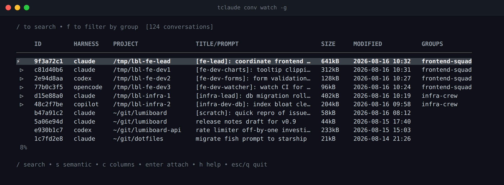

# Conversations

A conversation is the durable transcript behind a session, plus tclaude's
index entry for it. Sessions are live tmux processes; conversations persist
in each harness's own store and outlive the session that produced them. A
session row can exit while its conversation stays listed, searchable, and
resumable.

`tclaude conv` is one merged index across all four harnesses: listings load
Claude Code's cwd-indexed `.jsonl` store and merge in conversations from
every other registered harness — Codex, OpenCode, and Copilot — read-only,
each entry tagged with its harness. Resume and watch-mode launch use the
recorded harness automatically.

Listing, search, resume, and archive are harness-agnostic. The physical
transcript operations — `delete`, `prune-empty`, `cp`, `mv` — and the
semantic index operate on Claude Code's store only; those sections say so.

The conversation record is independent of tmux process history: pruning an
exited row from `session ls` does not touch the conversation, its recorded
harness, or its resume provenance. Listing, search, archive, and resume also
work for conversations that were never enrolled as agents.

## Listing

```bash
tclaude conv ls              # conversations for the current project
tclaude conv ls -g           # all projects
tclaude conv ls -n 10        # limit
tclaude conv ls --since 7d   # time filter
tclaude conv ls -w           # interactive watch mode
```

Useful flags: `-l/--long`, `-j/--json`, `-c/--count`, `-s/--sort-by
created|modified|messages|prompt|project` with `-a/--asc`, `--since` and
`-b/--before` (durations like `1h30m`/`7d` or dates), `-r/--reindex` to force
a rescan of transcript files, and `--show-archived` to include conversations
hidden by tclaude archival (plus Codex conversations archived in Codex's own
native store).

`tclaude conv watch` is a shortcut for `conv ls -w`; in watch form only
`-g`, `--since`, and `--before` apply.

Conversations are indexed per project directory, so a plain `conv ls` in a
repo shows that repo's history — including a worktree's own history when run
inside the worktree — and `-g` widens to everything tclaude knows about.

## Searching

```bash
tclaude conv search "authentication"           # title/prompt search
tclaude conv search -g --since 24h "bug fix"   # global, time-filtered
tclaude conv search --content "exact error"    # full transcript search
```

Title-and-first-prompt search is the default. `--content` also reads the
transcript files themselves — slower, and cold Codex rollouts stored as
compressed `.jsonl.zst` are not decompressed, so those are matched on
metadata only. Other flags: `-C/--context` for surrounding lines,
`-s/--case-sensitive`, `--sort-by … matches`, plus the usual `-g`, `-l`,
`-n`, `-j`, `-c`, and time filters.

## Resuming

```bash
tclaude conv resume <conv-id>
tclaude conv resume -d <conv-id>   # detached
```

`conv resume` finds the conversation in any harness's store, changes to its
project directory, and relaunches it through its **recorded harness** in a
new tmux session — you never tell it which CLI to use. The relaunch also
carries the conversation's recorded launch posture; see
[Sessions](sessions.md#a-resume-keeps-its-recorded-posture).

The lower-level equivalent is `tclaude session new --resume <id>`, which
needs `--harness` for non-Claude conversations.

One gate: a conversation whose live agent is driven through Copilot's API
drive is refused a plain relaunch; pass `-s/--send-keys` to explicitly
proceed with a tmux send-keys launch instead.

## Archiving

```bash
tclaude conv archive <conv-id>
tclaude conv ls -g --show-archived
tclaude conv unarchive <conv-id>
```

Archiving works for any indexed conversation, whatever its harness. It
stamps `archived_at` in tclaude's SQLite conversation index; the transcript
on disk is untouched and the operation is fully reversible. Archived
conversations are hidden from `conv ls` unless `--show-archived`.
Reincarnation archives the predecessor conversation through the same
mechanism.

Codex additionally has its own native archive state; tclaude surfaces it via
`--show-archived` but never modifies it.

## Claude Code transcript operations

These commands manipulate transcript files in Claude Code's cwd-indexed
store. They do not touch Codex, OpenCode, or Copilot stores.

### conv delete

```bash
tclaude conv delete <conv-id>      # with confirmation
tclaude conv delete -y -g <id>     # skip confirmation, search globally
```

Deletes the transcript, including any resumed "generations" of the same
conversation.

### conv prune-empty

```bash
tclaude conv prune-empty           # current project
tclaude conv prune-empty -g -n     # global, dry run
```

Deletes conversations with no user messages, stale index entries, and
dangling companion directories (subagent transcripts).

### conv cp / conv mv

```bash
tclaude conv cp <conv-id> /path/to/other/project
tclaude conv mv <conv-id> /path/to/other/project
```

Copies or moves a transcript to another real project path so it lists (and
resumes) there. `cp` assigns the copy a new UUID. `-f` overwrites, `-g`
searches globally.

## Watch mode

`tclaude conv watch` (or `conv ls -w`) is an interactive picker over the
merged conversation list:



*Conversation watch across all projects and harnesses*

| Key | Action |
|-----|--------|
| `↑`/`↓`, `j`/`k`, `PgUp`/`PgDn`, `g`/`G` | Navigate |
| `Enter` | Create or attach a session for the selected conversation |
| `/` | Text search: title, first prompt, project path, git branch, session id |
| `s` | [Semantic search](#semantic-search) (requires Ollama) |
| `x`/`Del` | Delete (session-aware confirmation, below) |
| `W` | Create a [worktree](worktrees.md) from the selected conversation |
| `r` | Refresh |
| `h`/`?` | Help |

Session indicators in the list: `⚡` means the conversation has an attached
session; `○` means an active background session.

Deleting a conversation that has an active session asks what to do: `y`
deletes the conversation and stops the session, `s` stops the session only,
`n` cancels.

## Semantic search

Semantic search ranks conversations by meaning rather than exact text, using
**local Ollama embeddings**. The default model is `qwen3-embedding:0.6b`
(`nomic-embed-text` also works); override with `--model` /
`TCLAUDE_EMBED_MODEL` and `--url` / `TCLAUDE_OLLAMA_URL` (default
`http://localhost:11434`).

!!! note "Claude Code transcripts only"
    The semantic index reads Claude Code's transcript store. Codex,
    OpenCode, and Copilot conversations are not indexed.

Requirements: a running Ollama with the embedding model pulled:

```bash
ollama pull qwen3-embedding:0.6b
```

Build or update the index, then query it:

```bash
tclaude conv index-embeddings         # incremental, by file mtime
tclaude conv index-embeddings -r      # full rebuild (needed after a model switch)
tclaude conv search-embeddings "that refactor where we split the parser"
tclaude conv search-embeddings -n 5 -l "flaky test investigation"
```

Indexing chunks each conversation (a metadata chunk plus ~24K-character
content chunks split at turn boundaries), embeds the chunks via Ollama, and
stores the vectors in tclaude's SQLite database. Embeddings are
model-specific, hence the `-r` rebuild when switching models. Queries rank
conversations by their best-matching chunk; `-l` shows the matched chunk
text, `-j` emits JSON, `-g` searches globally.

In watch mode, `s` enters semantic search — offering to index unindexed
conversations first — and adds a SCORE column; `Esc` returns to the normal
listing.

## Conversation IDs and time filters

Conversation IDs are accepted as the full UUID, any unique prefix of 8+
characters, or the decorated form shell completion produces
(`abc12345_[title]_prompt…`).

Time filters take durations relative to now (`24h`, `7d`, `2w`) or dates
(`2026-01-15`, `2026-01-15T10:30`):

```bash
tclaude conv ls --since 2026-01-01 --before 2026-02-01
```
