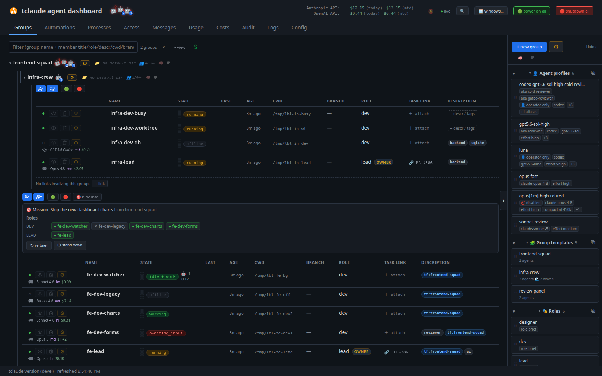
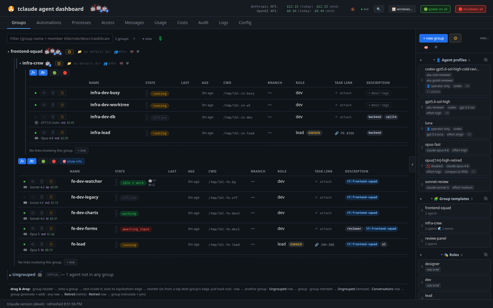
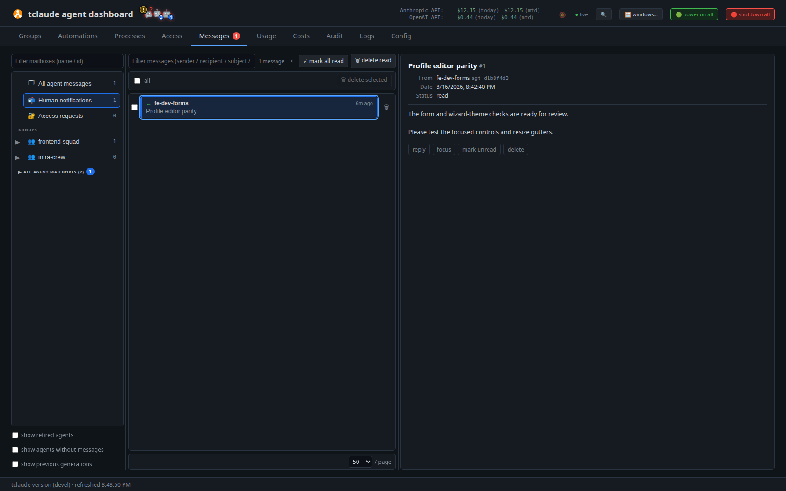
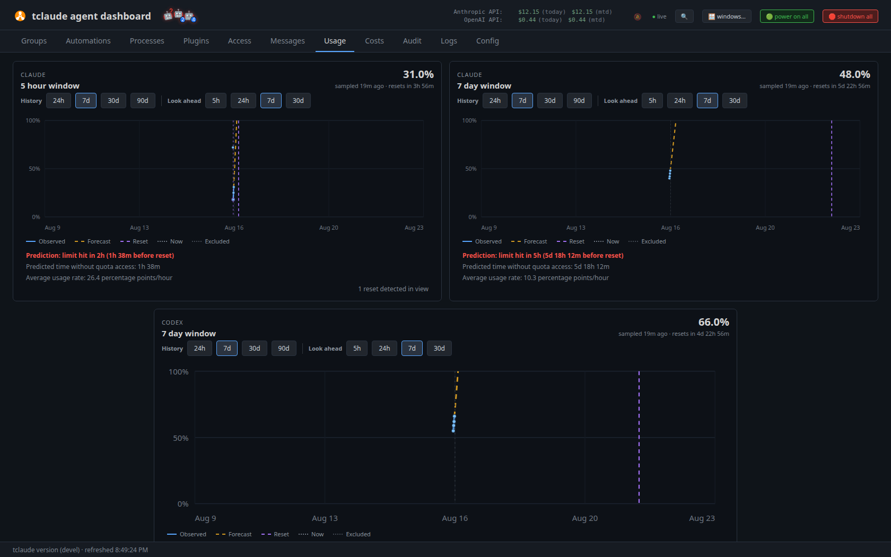
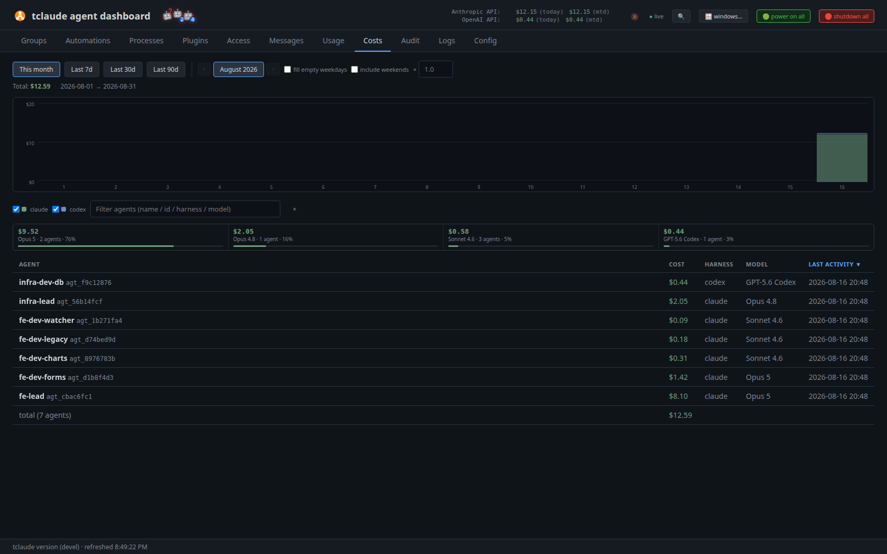

# Dashboard

The dashboard is the browser operations console for your agent fleet. Its
design thesis is observability with zoom on demand: one screen shows every
group and agent at a glance — status, context pressure, cost, branch and CI
state — and any row can be zoomed into a fully interactive live terminal
attached to the agent's real tmux pane. You go from "the whole fleet looks
healthy" to "typing into this one agent's session" in two clicks, and back.

It is served by the `agentd` daemon and is human-only: agents talk to `agentd`
over its API, not through this UI. For the daemon itself and how agents relate
to it, see [Agents and groups](agents-and-groups.md).



*The Groups home view: a nested group with per-agent state, cost, context, roles, task links — and the profile/template/role libraries on the right rail*

## Opening it

```bash
tclaude agent dashboard          # open in your default browser
tclaude agent dashboard --print  # print the one-shot URL instead
tclaude agent ui                 # alias
```

The command asks the daemon for a one-shot URL and opens it; the single-use
token expires in about a minute, so treat a `--print`ed URL as
use-immediately. `--slop` and `--wizard` open the cosmetic re-skin themes
(mutually exclusive; slop wins).

The dashboard listens on loopback only by default (`127.0.0.1`). By default
the port is random per `agentd serve` (so the URL changes across restarts);
set `agent.dashboard_port` for a fixed port, which then fails loudly if
taken.
Whether `tclaude agentd serve` auto-launches a browser is configurable in
Config → agentd daemon & server. For reaching the dashboard from another
machine or a phone, see [Operating remotely](remote.md).

## The tabs

In order across the top:

| Tab | What it is |
|---|---|
| Groups | The home view: fleet roster, spawning, live status |
| Terminals | Web-terminal multiplexer; hidden until a pane is open |
| Automations | Exports, cron jobs, standing orders, triggers |
| Processes | Process template editor (feature-flagged) |
| Plugins | Shell-step plugin lists with status lamps |
| Access | Permissions, slug registry, sudo (three subtabs) |
| Messages | All agent mail, human notifications, access requests |
| Usage | Subscription quota bars and forecasts |
| Costs | Real and what-if spend |
| Audit | Trail of daemon-proxied mutating actions |
| Logs | Viewer over the daemon log |
| Debug | Poll-latency self-diagnostics (hidden by default) |
| Config | Visual editor for `~/.tclaude/config.json` |

`[` and `]` cycle tabs; Ctrl/Cmd-K opens a command palette covering tab
navigation, window focus, spawn, retire, power, and every manager dialog.
Debug appears only with `dashboard.show_debug_tab`; Processes only with
`features.processes`. A theme-gated **Vegas** button appears in the slop and
wizard themes (or via `slop.vegas_in_regular_mode`).

The **wizard** theme renames everything (Parties, Scrying, Labours, Rites,
Contraptions, Wards, Missives, Reserves, Coffers, Chronicle, Runes, Alchemy,
Almanac, The Tavern) and the **slop** theme goes full casino; both are
re-skins of the same dashboard, not different feature sets. Cycle themes with
the header icon (Ctrl/⌘+Alt+Shift+S toggles slop, the same chord with W
toggles wizard), or force one with `?slop=1` / `?wizard=1`.

## Groups — the home view

The default view is a compact roster: groups, and under each group its member
agents, one row per agent. An optional read-only route-map island
(feature-flagged) draws the group topology.



*Activity badges on a busy fleet: sub-agents, background shells, and monitors counted next to each state pill*

The filter bar holds query/visibility/column controls, a `💲` toggle for
per-row cost badges, default spawn- and sandbox-profile pickers, `+ new
group`, and a `⚙` actions menu (type-to-filter) with import group (.zip from
export, with preview and collision handling), clean up (bulk unjoin / retire /
delete / reinstate), delete retired, and managers for profiles, templates,
roles, sandbox profiles, cross-harness spawns, and **links** — links is a
modal opened from here, not a tab. Drag and drop works throughout: nest and
reorder groups, move rows between groups, drag a row to the bin to retire it,
drag it back to reinstate.

### The member row

The row's `⚙` menu includes **export debug info**, a direct JSON download that
separates the requested, resolved, and running configurations: original spawn
parameters, durable/composed sandbox settings, and latest launch evidence,
including executable/mount exposure, PATH construction, and agentd/host/sandbox
UID and GID identities. On Linux a live harness PATH and process identity are
observed from `/proc` when available. It
works while the agent is offline. The export includes environment values and
local paths, so treat it as sensitive; task text and one-time authorization
tokens are redacted.

Columns are hide/showable via "▾ view" (persisted server-side):

- **ctl** — status dot, row actions, and the harness line:
  `CC · Opus 4.8 hi $0.42` — harness mark, model, effort short code
  (lw/md/hi/xi/mx), and session cost. Real spend shows as `$x.xx`;
  subscription usage shows a what-if `≈$x.xx` — an estimated
  pay-per-token-equivalent, hypothetical, not a real charge.
- **Name** — inline-renameable; a `!` glyph marks unread notifications.
- **State** — the context meter, a state pill (working / idle / `idle + work`
  when the main agent is idle but background work runs / awaiting_permission /
  awaiting_input / error / crashed / restarting / crash loop / offline /
  waking), and activity badges.
- **Last** (last hook), **Age**, **CWD** — startup dir and current dir stacked
  as `init`/`now`; click opens a terminal there.
- **Branch** — `⎇ branch` GitHub link, PR pill, CI pill, and any PRs presented
  via `tclaude agent present-pr`.
- **Role** (with `owner` badge), **Task** — a clickable 🔗 work-item URL set
  via `tclaude agent task`, with inline `✎` edit — and **Description** with
  tag chips.
- **ID** — the short agent id, hidden by default.

The status dot is clickable: `●` online (click to turn off — soft exit or
force kill), `○` offline (click to wake), with error and waking variants.

### Badge glossary

Badges appear on rows only while relevant (activity badges only while online
with a non-zero count):

| Badge | Meaning |
|---|---|
| 🤖+N | N sub-agents still running |
| ⚙+N | N background shell commands still running |
| 👁+N | N monitors still watching (log tail, CI poll, websocket) |
| 🚫 | agentd has refused N brokered callbacks from this session |
| 🔒 | Sandbox confined |
| 🔒² | Sandbox stacked (two layers) |
| ⚠ | Sandbox off, unknown, or not enforced |
| 📱 | Remote control armed (Claude Code; best-known state) |
| ⚡ | Codex fast mode |
| 🔓 | N active sudo grants (click to manage) |

The 🚫 broker-refusal badge deserves attention: when it shows, the entire row
— status, model, cost, context, directory — is frozen at its last accepted
value. The usual cause is a dead session row on the same pid or a session-id /
ancestry mismatch. The sandbox badge's tooltip breaks down status,
implementation (TClaude / CC+TClaude / CC / None), profile, and cgroup memory
and CPU limits; clicking it temporarily disables or restores the sandbox
(not available for Codex built-in sandboxes). See
[Sandboxing](sandboxing.md). Clicking 📱 opens the live session in a web
terminal; its tooltip notes the value is tracked, not read back from the
harness — see [Operating remotely](remote.md).

Group and global activity summaries show as rows of little 🤖 faces with
corner tags — ❓ asking, 💥 error, 💀 crashed, 💤 offline — with a hover panel
grouping workers by state.

### The context meter

Each row carries a five-segment context meter running green → yellow → red.
The tooltip reads like `context: 120k / 200k tokens (assumed cap) — 60%`, and
the suffix tells you where the cap number comes from: configured, reported by
the harness, from the model catalog, or assumed. There is no per-row quota
column — subscription quota lives in the header usage island and the Usage
tab.

The header usage island shows one line per provider (Claude / Codex / Copilot
/ API) with an 8-block bar, percentage, and remaining amount: Claude tracks
the 5-hour and 7-day rolling windows, Codex 5-hour and weekly, Copilot the
monthly premium-request allowance, plus API cost month-to-date and today
(click through to the Costs tab).

### PR and CI pills

The PR pill (`#1234`) is colored by state (open / draft / merged / closed).
The CI pill reads `✓ 12/14` with glyphs ✓ ✕ ◐ · (the denominator excludes
skipped checks). Hovering or focusing either opens a checks panel that
re-polls every 6 seconds while open: failures first, then running, pending,
and passed/skipped, with live elapsed timers and a link to the GitHub checks
page. The data comes from `git` and `gh` off the snapshot path, cached with a
90-second TTL. The footer's **Open PRs** popover reuses the same badges with
Open / Needs attention / Unattached / Closed filters and an "Open all on
GitHub" action. Drafts are muted grey and stay out of **Needs attention** by
default; select that filter to reveal its **Include drafts** checkbox.

### Zooming into a terminal

Row actions:

- **term** / **web term** — a fresh shell in the agent's directory, native or
  in-browser.
- **open window** / **web window** — attach to the agent's live harness TUI.
- **👁 focus** — jump to the agent's web pane by default, or its native window
  when `dashboard.default_terminal` is `"native"`; the crossed-eye variant
  hides the native window (detaches the tmux client; the agent keeps running).

Web terminals are fully interactive attached PTYs (xterm.js over WebSocket,
backed by a real tmux client) — there is no read-only mode; what you type
lands in the agent's session. Ctrl/Cmd-click opens a pane in the background.
`✉ Message` (Ctrl/Cmd+M) sends a queued message to the agent instead of
typing into its pane. Reconnection is deliberately conservative: bounded
auto-retries, then only a proven `agentd` restart earns one automatic
reattach; otherwise you get a manual Reconnect button.

Directory fields also use the in-dashboard web picker by default. Set
`dashboard.default_directory_picker` to `"native"` to use the host OS chooser
on a local dashboard; remote dashboards always use the web picker.

Mouse selections owned by OpenCode and Copilot are copied into the browser
through OSC 52. Their tmux passthrough permission is enabled only on those
harness windows; the shared tmux server and other harnesses remain unchanged.
To make a browser-owned selection instead, use Option-drag on macOS or
Shift-drag on Linux/Windows.

### Creating a group workspace

The new-group dialog can either point the group at an existing directory or
clone a GitHub repository over SSH or HTTPS. For a clone, agentd creates any
missing parent directories, runs `git clone` with the credentials available to
the daemon process, and makes the checkout the group's default working
directory. The repository's web URL can also be stored as the group's
persistent attachment link. Clone failures stay in the open dialog so the
draft can be corrected and retried. The dashboard remembers the last selected
SSH/HTTPS transport for the next group.

### The spawn dialog

`+` on a group (group pinned) or the top-level spawn action (with a Group
select) opens the spawn dialog. It fronts the same spawn path as
`tclaude agent spawn` — see
[Spawning and lifecycle](spawning-and-lifecycle.md) — with fields for: a
reusable **Profile** bundle (save-as/clear), name, initial message,
attachments (upload, drag, or paste — they become the startup briefing), roles
and display role, make-owner, a birth-permissions editor (grant / deny /
inherit per slug), description, task link, harness, model (curated or custom
id), effort, Codex fast mode, auto-compact window and context max, sandbox
implementation + harness sandbox mode + sandbox profile, approval policy /
permission mode with autonomy warnings, approval reviewer, OpenCode tool
governance, question timeout, pre-trust directory, CWD with a browser,
worktree repo / worktree / new branch and base, auto-focus terminal, include
group default context, a **Start with remote control** checkbox (Claude Code
only; default resolved from group policy, then profile; the per-spawn value
wins), Claude context-features trim, keep-CC-auto-memory, and the
experimental Copilot API and Codex app-server drives.

## Terminals

The Terminals tab is the in-dashboard terminal multiplexer. It stays hidden
until the first web terminal or web window is opened; its badge counts live
panes. Each pane's tab carries a live status glyph. Tabs drag-reorder, and
drag onto each other to form named, collapsible tab groups. Drag a tab off
the strip to detach it into its own browser window; drag the pop-out's header
back to reattach — `⧉ tab` / `↩ dashboard` buttons are the explicit path.

## Automations

Subtabs All / Exports / Cron jobs / Standing orders / Triggers:

- **Exports** — conversation-summary export jobs with a step stepper and a
  download action; started from an agent row's ⚙ → "📋 summary…".
- **Cron jobs** — scheduled ✉ message or ⚡ spawn actions (spawn profile,
  roles, concurrency Forbid/Allow with a max-live-workers cap), on an
  interval (≥30s) or cron expression, with run-now, a recent-runs log
  inspector, edit, duplicate, enable, and delete. The CLI equivalent is
  `tclaude agent cron`.
- **Standing orders** — trigger-driven standing instructions bound to
  portable events (session.start with source narrowing, user.prompt,
  tool.before/after) or per-harness hook catalogs, with an optional RE2
  condition on cwd / prompt / tool name / tool input, same-continuation vs
  next-turn delivery, cadence, minimum interval, and debounce. Each target
  shows a capability pill (supported / degraded / unsupported).
- **Triggers** (feature-flagged) — rules on PR opened/updated/merged, CI
  failed/succeeded, or agent idle / awaiting-input (with dwell), firing spawn
  or templated-message actions; armed / cooling / disabled states.

See [Teams at scale](teams-at-scale.md) for the automation workflows these
surfaces drive.

## Processes

Feature-flagged behind `features.processes`. A single Templates subtab lists
templates (rename, describe, versions, delete), creates new ones, and can hand
one to a process scribe agent via "Edit with agent". The graph editor covers
Task / Decision / Parallel / Wait / Start / End nodes, human | agent | program
performer slots, optional plan-before-work and review-gate stages,
retry-on-fail modes, outcome-labelled edges, live server validation, undo/
redo, snippets, a params dialog, and versioned saves with external-change
detection. Instantiated runs and human work items are API/CLI-only and are
not rendered on the tab. See [Processes](processes.md).

## Plugins

Named lists of shell steps (check / run / stop) with per-plugin status lamps
(active / not active / off / still active), per-step control, a minute-cadence
re-check, an editor, and catalog install. A warn badge on the tab counts
problems.

## Access

Three subtabs:

- **Permissions** — default slugs from config.json plus permanent per-agent
  grant/deny overrides. A tri-state dialog per slug (Default / Grant / Deny —
  deny is an explicit veto), effective-source display, 👑 owner-implied
  markers, and scope drawers for scoped slugs. Sibling dialogs edit group
  permissions (immediate; an agent-level Deny still wins) and role
  permissions (grant-only).
- **Slug registry** — a read-only list of every registered capability with
  slug, owner, and description, plus ownership badges.
- **Sudo** — active time-bounded grants with live expiry countdowns, reason,
  granted-by, and revoke, plus a proactive "+ Grant sudo" dialog (default
  5 minutes; permissions.grant/revoke are blocklisted from sudo).

Pending permission requests are not here — they live in Messages under
🔐 Access requests. The model behind all of this is documented in
[Permissions and audit](permissions-and-audit.md).

## Messages

Three draggable panes: sidebar → list → reader. It shows every `agentd`
mailbox — agent-to-agent mail and the human-notification channel
(`tclaude agent notify-human`) — with an all-messages firehose, a human-
notifications folder, per-group folders expandable to members, and per-agent
folders. The list is newest-first with direction glyphs, unread and pending
markers, attachment counts, and bulk actions; the reader renders Markdown,
offers downloadable agent-published attachments with image preview, and can
reply (human folder), focus the sender's terminal, or toggle read state.



*The Messages tab: mailbox tree on the left, thread list and reader on the right*

The **🔐 Access requests** folder is where blocked permission requests
(`--ask-human` and friends) arrive as Approve / Decline / scoped Always-allow
cards with an auto-decline countdown and a "+5m" extend button. A banner and
blinking badge surface pending requests from any tab, requests are actionable
remotely, and history survives restarts. Compose paths: a group's cog
✉ message (whole group or a ticked subset) and a top-level `+ message`
operator dialog with role filtering and attachments for offline recipients.

## Usage

Subscription quota and forecasting: one card per provider × quota window
(Claude 5-hour / 7-day / 7-day-Sonnet; Codex 5-hour / weekly; Copilot monthly
premium requests). Each card shows the current percentage, sample age, and
reset countdown over an SVG chart with the observed line, a dashed forecast
line, reset markers, a now marker, and excluded points. Sampling runs every
15 minutes with 90-day retention; history spans 24h to 90d and look-ahead 5h
to 30d, persisted per series.



*Per-provider quota windows with least-squares forecasts — here predicting the Claude five-hour window goes dark 1h38m before reset*

The forecast detects resets (a declared boundary, or a downward step of at
least 2 points), then estimates a pace on the post-reset segment, yielding
%/hour and an ETA to 100%. Each card picks which estimator draws its dashed
line with its own **Prediction** control, next to the span controls, and the
choice persists per series:

- **Span** (default) extends the straight line through the first and last
  sample inside that card's history range. Narrowing the range to 24h is how
  you ask for a more recent pace.
- **Recent** uses only the newest few samples, so a burst that started minutes
  ago is not averaged against the idle hours before it; it reaches further back
  only when those samples are bunched too close together to divide by.
- **Fit** is a least-squares slope on the post-reset baseline — a running max,
  so brief dips don't lower the pace. It is the smoothest and the slowest to
  react: a long idle stretch holds it down well after usage starts climbing.

All three are computed server-side for every card and ride on the same
response, so switching is instant; all are anchored at the latest sample and
clipped to the current segment, so no line is drawn across a reset. A forecast
needs at least 3 samples over 30 minutes in its own window before it commits
("Prediction warming up"), and reports statuses such as "limit hit Xh before
reset" with the predicted no-quota window. **Click any point to exclude it**
from all the math (and click again to restore) — useful when a one-off spike
would poison the forecast. There is no per-model quota breakdown; providers
do not expose reliable attribution. OpenCode activity raises a coverage-lag
warning banner.

## Costs

Spend over time: a stacked daily bar chart per harness, a per-model rollup
strip, and a sortable per-agent table with totals and cross-day agent chains.
Spans are This month (the only span with a projection), 7d/30d/90d, and a
month browser going 24 months back.



*The Costs tab: month bars, per-model breakdown cards, and the per-agent table*

Real API spend and subscription **what-if** estimates are kept visually
distinct throughout: totals split into `$real + ≈$whatif`, a banner appears
whenever estimates are mixed in, and estimated rows carry ⚠︎ with a hover
breakdown (Copilot credits show as "N credits — $X subscription value").
The month projection extrapolates spend over elapsed weekdays, with toggles
for filling empty weekdays and including weekends. A display-only cost
multiplier input scales all displayed figures. On subscription accounts the
tab appears only when enabled in Config.

## Audit

The trail of daemon-proxied **mutating** actions — spawns, messaging,
lifecycle verbs, group and permission changes, sudo grants, proxy calls,
power operations, and more; read-only polling is not recorded. Columns: When,
Actor (operator / agent / tclaude / unknown), Action (color-coded, ⊞ marks
dashboard origin), Target, Detail (clipped and privacy-bounded; spawn rows
carry a `?` popover with request, resolved params, and response), and an
Outcome pill — ok / denied / rejected / err, with **denied attempts
included**. Server-side search plus source and outcome filters. Retention
defaults to 30 days (`audit.retention_days`; negative keeps forever). The
full recording policy is in [Permissions and audit](permissions-and-audit.md).

## Logs

A paged viewer over `~/.tclaude/output.log` and its rotated files: level
pills, structured fields, search, a level floor, a since filter, and a
2-second live-stream toggle.

## Config

A visual editor for `~/.tclaude/config.json`. Save shows a line diff before
writing anything; the filter hides sections, never individual keys. Sections
cover terminals and windows, dashboard behavior, usage/costs/rate-limits,
context and compaction, notifications, spawn and clone policy, ask and scribe
defaults, the daemon and server (dashboard port and bind, tray,
operator-token persistence), logging, retention, slop mode, experimental
features, and the remote-access panel described in
[Operating remotely](remote.md).

The **Debug** tab (enable `dashboard.show_debug_tab`) shows in-memory
poll-latency self-diagnostics per endpoint — p50/p90/p99/max, sparkline,
per-phase breakdown — reset on daemon restart.

## Shared behavior

The dashboard polls a full snapshot every 2 seconds (10 when the tab is
hidden); two consecutive failures raise a full-screen "Disconnected from
agentd" overlay that clears itself on recovery.

**Auto-reload**: the daemon fingerprints its embedded frontend assets and
sends the fingerprint with every snapshot. When you upgrade tclaude and
restart the daemon, every open dashboard notices the mismatch, shows
"tclaude updated — reloading…", and reloads itself. An open terminal pane can
refuse the reload (its beforeunload prompt fires so you don't lose an
attached session); a cancelled reload adopts the new baseline after a few
seconds rather than nagging.

Browser notifications ride a separate 3-second poll with server-decided
delivery; the header bell is the master toggle with per-type switches, and
groups have 🔔/🔕 mutes with per-agent overrides. The footer shows the daemon
version, refresh time, and the Open PRs popover; the right edge holds a dock
for dragging profiles, templates, and roles.

## The TUI dashboard

A terminal fallback for when a browser is unavailable — a fleet list, not the
full console.

```bash
# in-daemon, local:
tclaude agentd serve --tui

# standalone, against a running daemon (local or over the network):
tclaude agent tui-dashboard --connect-to <url|host[:port]>
```

`--tui` replaces the web dashboard unless you also pass a dashboard flag. The
standalone form (alias `tui`) requires `--connect-to`; there is no standalone
local mode. Standalone auth, in order: `--operator-token`,
`--remote-operator-token user@host:/abs/path` (reads the token over ssh; the
two are mutually exclusive), then local operator-token lookup.

It shows six columns — AGENT / GROUP / STATUS / HARNESS / DIRECTORY / BRANCH
— plus plain host tmux sessions (local console only) and a usage/cost status
line, polling every 2 seconds. Keys: ↑↓/jk move; enter attaches (locally via
tmux switch-client, remotely streamed over WebSocket, detach with ctrl-] d)
or resumes an offline agent; `n` opens a spawn form; `s` a local shell (local
only); `delete` steps live → offline → retired with confirmation; `f` filters
to active; `?` help; `q` quits — and an in-process `q` **shuts down the
daemon**, while standalone just exits.

The spawn and shell forms' text fields take your terminal's paste (bracketed
paste — `ctrl+shift+v`, `cmd+v`, tmux `paste-buffer`), folding any line breaks
in the pasted text onto the single line the field is. `ctrl+v` is deliberately
not bound: it would read the host's system clipboard, and the console can be a
pane an agent drives through tmux `send-keys`.

Its server surface is a small versioned JSON API plus one attach WebSocket —
no groups tree, automations, processes, plugins, access, messages, costs,
audit, logs, or config, and mutations are limited to spawn, resume, stop, and
retire. The TUI client has no client-certificate options, so it **cannot
connect through the remote-access mTLS listener**; the supported network path
is the plain dashboard listener exposed via `--dashboard-bind` /
`agent.dashboard_bind` behind your own auth or VPN (see
[Operating remotely](remote.md)).

## Frontend ownership and imperative boundaries

Preact is the default owner for operator-facing markup, drafts, validation,
busy/error state, dialogs, lists, and forms. Static dashboard HTML may provide
an empty stable host, but it must not contain a second dialog implementation.
Snapshot polling and reconciliation must not inspect UI draft state or pause
because an editor is open. Cross-feature `data-act` routing snapshots an
immutable plain descriptor before starting an operation; DOM attributes are
not request or application state.

Imperative code remains only at the following explicit boundaries. A module
that directly creates or injects DOM carries a
`dashboard-imperative-boundary` marker naming one of these categories; the
architecture test discovers markers rather than maintaining a filename
allowlist.

| Marker / surface | Ownership | Lifetime and disposal | Behavioral test expectation |
|---|---|---|---|
| xterm terminal core | Preact owns terminal tabs, shells, and stable hosts; xterm owns only the opaque descendants handed to `terminals-core.js`. | Terminal close/unmount disposes the terminal, addons, socket, resize observer, and listeners. Reconciliation may retain or retire a host but never rebuild xterm children. | Mount/close/pop-out and roster reconciliation tests must prove opaque-node identity and teardown. |
| `process-graph` | Preact owns editor/dialog state; `process-graph.js` and `process-graph-adapter.js` exclusively own their SVG/canvas-like host. The connector-drop `process-node-chooser.js` owns its anchored combobox/listbox subtree. | The adapter removes pointer/key listeners, connection bands, and graph instances on keyed replacement/unmount. Closing or disposing the chooser removes its document listener and subtree; cancellation restores focus, while unmount disposal leaves focus to the next owner. | Graph interaction tests cover selection, drag/connect, rerender identity, and disposal; chooser tests cover selection, cancellation, focus, click-away, and idempotent disposal. |
| `cost-chart` | Preact owns filters, data derivation, and the chart host; `costs-chart.js` owns the chart's drawing nodes only. | Each effect clears/replaces the chart host and returns cleanup before the next draw or unmount. | Costs tests cover filtered redraw, empty/error states, and chart cleanup without asserting incidental node layout. |
| drag and drop | Preact emits live keyed producers and semantic `data-*` descriptors; `dnd.js`, `group-reorder.js`, `dock-dnd.js`, and `dock-save-dnd.js` adapt native `DataTransfer` events. | Every binder is idempotent, returns cleanup, resets gesture state on `dragend`/unmount, and rejects detached producers. | DnD tests cover copy/move/delete intent, cancellation, cleanup, and live-source guards. |
| `media-effects` | The Vegas audio player and slop/wizard cosmetic modules are boot-time, page-lifetime effects that own media elements, particles, and the explicitly opaque reel host. They do not own operational state. | Their delegated document listeners intentionally live until navigation and are not `pageCleanups`. Within that page lifetime, transient nodes self-remove, Vegas stops audio and polling timers when inactive, and identity tokens prevent stale timers from overwriting a newer Preact host. | Reduced-motion, stale-timer, inactive-audio, and opaque reel hand-back tests are required. |
| `platform-layout` | Scoped browser effects own focus traps, resize, horizontal scroll, navigation history, overlay stacking, and stable shell/dock re-homing. The dashboard profile controls are Preact-owned inside named stable hosts; the hosts move between the toolbar and dock while each chip can turn into an inline picker. `island-lifecycle.js` owns only its claimed host's load-failure alert. | Effects attach to refs/stable shell nodes and return cleanup. Focus returns to the remounted chip after keyboard cancellation. Island failure rendering replaces only the claimed host; successful cleanup releases host ownership. | Binder lifecycle, inline-picker focus, overlay stack, dock identity, refresh-generation, and island rollback/ownership tests cover these contracts. |
| `browser-io` | Operation modules may create a short-lived download anchor, clipboard textarea fallback, or standalone Preact host solely to invoke a browser API. `xterm-loader.js` owns the non-visual script node used to fetch the classic xterm runtime on first valid terminal intent. | Temporary operation nodes and object URLs are removed/revoked in the same operation; no draft or request state is stored on them. The xterm script and installed global intentionally live for the page lifetime, while an in-flight promise deduplicates concurrent opens and a failed load is retryable. An auth-aware HEAD preflight preserves the dashboard's expired-session redirect before script injection. | Payload/download/clipboard tests assert the invoked browser contract and cleanup. The xterm loader test proves imports cause no fetch, auth failure causes no injection, concurrent requests append one script, and a ready runtime is reused; facade tests prove canceled/invalid requests do not prepare it. |
| `config-adapter` | `config-form-adapter.js` and `remote-admin.js` are bounded adapters for server-described native controls embedded in Preact-owned config surfaces. | Activation is generation-guarded; option/list replacement is scoped to the supplied control, and the Config island owns activation cleanup. | Config activation and retry tests must prove stale loads cannot publish into a replacement control. |
| `preact-compat` | Preact remains the visual owner. This marker covers trusted legacy readback HTML and standalone process-dialog wrappers used outside the main editor tree, not permission to build new imperative UI. | Injected markup is escaped/trusted at its model boundary; standalone hosts unmount Preact and remove themselves on completion. | Readback escaping and standalone-dialog close/disposal tests are required. New uses need explicit review and documentation here. |

One surface sits just inside that allowance and is worth naming, because it
reads at a glance like an exception: `menu-filter.js`, the type-to-filter core
behind the ⚙ cog menus, decides which items a query keeps by **reading the
rendered menu** rather than from data. It is not new imperative UI — it creates
no nodes, and Preact still owns the box, the query and every item — but it does
mark items on a Preact-rendered subtree. Two properties keep that safe. Its
three `data-menu-*` attributes are declared by no vnode, so Preact never diffs
them and a snapshot publish cannot fight them; and `ActionMenu` re-applies the
filter after every render, so items that appear or disappear with the snapshot
are re-evaluated. Reading the DOM is also the only complete option here: several
items (`NotifyMenuItem`, `RemoteMenuItem`, `RestartMenuItem`,
`SandboxRestartMenuItem`) compute their own label inside the component from live
member state, so no call site knows what they say — and matching the rendered
text means the filter cannot drift from the labels the operator can see.

The guard intentionally allows ordinary ref-based effects (`focus`, measure,
scroll, browser APIs) and rejects undocumented DOM ownership. If a new surface
needs imperative ownership, first prove that Preact cannot own the ordinary UI,
add a documented category/lifecycle/test contract, and then add the source
marker. Do not solve a guard failure with a compatibility re-export, static
dialog markup, or a blanket filename exception.

## Visual smoke testing (contributors)

`TCLAUDE_DASHSNAP=1 TCLAUDE_DASHSNAP_SHARD=1/4 go test ./pkg/claude/agentd/
-run TestDashSnap -v -count=1 -timeout 600s` renders the dashboard matrix
with the host's Chrome/Chromium and writes screenshots for manual review; run
shards 1/4 through 4/4 (a few minutes each; an unsharded run needs
`-timeout 1800s`). Optional, environment-dependent, and not wired into CI.
