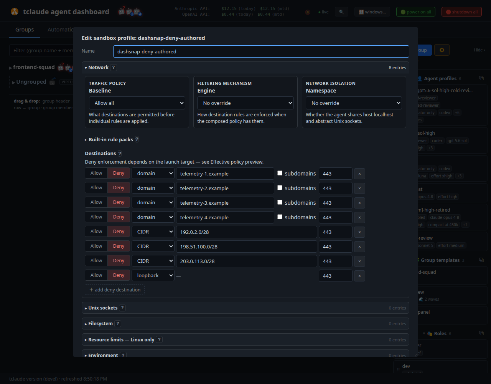

# Network filtering

A sandbox profile's `network` axis controls where an agent's traffic may go.
tclaude enforces it with one of two engines under the `tclaude-layer` sandbox
implementation: a **packet engine** (the Linux default — a private network
namespace with a default-drop firewall and a DNS broker) and a **proxy engine**
(`network.engine: "proxy"` — an empty namespace whose only way out is a
filtering proxy that decides on the *name* the client asked for). One launch
uses exactly one engine; combining them is refused.

This page covers how profiles express network policy, how each engine enforces
it, and where each engine's guarantees end. The profile model itself is on the
[sandboxing](sandboxing.md) page.

## Expressing policy in a profile

A profile's `network` block authors a `baseline` — `inherit`, `allow`, or
`deny` (the legacy `network_access: internet|none` spelling is still
accepted) — plus allow and deny rows. Composed across scopes, the rules
resolve each launch to an effective open, closed, or list-filtered posture.
Rows are built from these selectors:

- `host` — an exact DNS name.
- `domain` — a DNS domain, optionally with `include_subdomains`; matching is
  label-bound, so `example.com` never matches `notexample.com`.
- `cidr` — IP-literal packet authority. A CIDR row carries no DNS authority:
  it does not admit DNS names whose answers happen to fall inside it.
- `loopback` — the host's own loopback services.
- `ports[]` — TCP and UDP both (QUIC counts as UDP); empty means all ports.



*The sandbox-profile network editor: baseline, engine, and namespace selectors above authored deny rows*

Deny rows compose as a union and win every overlap; rule order is irrelevant.
Under a deny baseline, allow rows are unlocks; under an allow baseline, deny
rows are restrictions — the editor labels the redundant cases instead of
rejecting them.

### Packs

Rather than hand-maintaining vendor endpoints, profiles reference
release-owned **packs**, stored as stable IDs, expanded at resolution time,
and frozen into launch snapshots. The current registry:

| Pack | Covers |
|------|--------|
| `net-local` | Unscoped loopback — local model servers (Ollama, LM Studio, llama.cpp), Codex OSS mode, host-local dev services |
| `net-anthropic` | Direct Anthropic API-key endpoints (`api.anthropic.com:443`) |
| `net-openai-codex` | Direct OpenAI API-key endpoints (`api.openai.com:443`) |
| `net-openai-chatgpt` | ChatGPT-signed-in Codex (`chatgpt.com:443`, `auth.openai.com:443`) |
| `net-github-copilot` | GitHub Copilot CLI model and auth traffic |
| `net-github` | GitHub (`github.com`, `api.github.com`, and friends) |
| `net-go-modules` | The Go module proxy and checksum database |
| `net-npm` | The npm registry |

`deny_packs` is the mirror image. New Deny-all drafts pre-select `net-local`,
`net-anthropic`, `net-openai-codex`, and `net-openai-chatgpt`; the packs stay
ordinary editable choices afterward. The saved shape keeps intent rather than
copying endpoints:

```json
{
  "network": {
    "baseline": "deny",
    "packs": ["net-local", "net-anthropic", "net-github"],
    "deny_packs": ["net-npm"],
    "allow": [{"domain": "example.internal", "ports": [443]}],
    "deny": [{"host": "telemetry.example.internal"}]
  }
}
```

### Namespace, and the unix-socket axis

`network.namespace` is independent of the baseline: `host` shares the host
network; `private` gives the launch its own Linux network namespace routed
through `pasta` with default-accept — it separates abstract Unix sockets and
host loopback from the agent without making IP traffic deny-by-default. It is
supported for exact Linux `tclaude-layer` Claude Code, Codex, OpenCode, and
Copilot launches, and refuses elsewhere rather than falling back. A private
namespace in a global or included profile cannot be widened by a child.

The `unix_sockets` axis (`mode: open|closed|list` plus `path`/`path_glob`
entries; `**` refused; the agentd socket is a non-removable floor) governs
filesystem Unix sockets. Authoring it as `closed` or a list on an otherwise
host-open profile gets a **host-network constructed root** on Linux: a fresh
filesystem root and PID namespace with the listed sockets bound back, but no
network namespace — host IP networking and the IDE bridge keep working. That
posture is permanently rated *partially enforced*: with the host network
namespace shared, abstract-namespace sockets (`@…`) are not filesystem objects
and no mount plan can hide them. Close network access too if those must be
confined.

### Composition across scopes

Allow authority intersects across the global, group, and explicit tiers while
deny authority unions — `(B1−D1)∩(B2−D2) = (B1∩B2)−(D1∪D2)` — and `closed`
dominates. Unix-socket lists intersect. `network.engine` is the one precedence
field: most explicit wins (explicit > group > global), with a disclosure when
composition was overridden.

## The three postures

- **Open baseline** (or omitted / legacy `internet`) → **host-open**: the host
  network namespace, host loopback services and ambient Unix sockets included.
  Ambient privileged sockets such as `docker.sock` are a named residual under
  an inherited root.
- **Closed** (`none`) → **isolated-with-agentd**: a fresh network namespace
  with only loopback up, a fresh PID namespace, and a constructed root with
  the agentd socket bound read-only. This severs IDE bridges and host-local
  model servers, so hosted-only harnesses are refused outright; Codex proceeds
  only with the explicit `TCLAUDE_OFFLINE_MODEL=1` operator assertion. On
  macOS, Seatbelt denies outbound and bind (agentd socket excepted) but
  provides no PID isolation, no constructed root, and — deliberately — no
  loopback exception. The dashboard spawn dialog's "Allow launch without
  enforcement" checkbox can widen exactly this closed-network gap for one
  fresh launch, never saved or inherited, recorded as
  `operator_unenforced_launch_override`.
- **List** → **filtered**, through whichever engine the profile deploys.

## The packet engine

The Linux default for a list or deny policy under `tclaude-layer`. Four
building blocks, assembled per launch:

1. **bubblewrap** creates user, network, PID, and mount namespaces with no
   connectivity, mapping the invoking user to namespace UID 0 (one-ID rootless
   mapping — not host root).
2. A pinned bootstrap installs a **default-drop nftables output policy**
   (`inet tclaude_filter`) inside the namespace as one atomic transaction,
   with timed per-rule IPv4/IPv6 sets. Only `CAP_NET_ADMIN` crosses that one
   exec; the bootstrap then drops every capability and sets no-new-privileges
   before the harness starts.
3. Rootless **pasta** provides outbound-only connectivity — no inbound
   forwards, no splice shortcuts. Harness exec is gated until the policy and
   pasta are both verified; if pasta or the broker dies, the supervisor kills
   the sandbox.
4. A **tclaude DNS broker** at `127.0.0.53` (a real listener on port 1053
   behind an nft redirect) answers only authored names. Each admitted A/AAAA
   answer is leased into the matching nft set for the observed DNS TTL, capped
   at one hour. Sealed memfds pin the nft batch and the sandbox's
   `/etc/hosts`/`resolv.conf`, so a hosts-file mapping cannot bypass the
   selectors. SVCB/HTTPS records are stripped, which blocks ECH config
   delivery and keeps TLS SNI observable — defense-in-depth.

DNS names are enforced at the **DNS-to-IP boundary**: an allowed name admits
the addresses its lookup returned, so another site hosted on a shared IP is
also reachable until the lease expires, and an established connection survives
expiry. New flows always need a current lease — an agent that performs no
fresh lookup after expiry cannot open another connection. Host, domain, CIDR,
and loopback selectors rate `Full` with that boundary stated; DNS-name *deny*
rows are `Full` under a deny baseline and `Partial` under an allow baseline
(another address for the same service, or encrypted DNS that bypasses the
broker, can remain reachable).

Host-loopback rows map to the synthetic name `host.tclaude.internal`
(`169.254.2.2` / `fd00::2`), filtered by the authored ports; `127.0.0.1` and
`::1` stay private to the sandbox. Known gap: the synthetic addresses are not
reserved from CIDR or DNS-derived rules, so either kind of rule can also reach
host loopback on its authored ports — a DNS-rebinding route to host services.

The packet engine is enforced for exact `tclaude-layer` **Claude Code, Codex,
and OpenCode** launches on Linux. When OpenCode supplies a strict explicit-
provider configuration, tclaude checks that provider endpoint against the
authored rules. An OpenCode route tclaude cannot inspect is left to those rules:
the launch proceeds, and the packet floor allows or blocks the actual request.
If a prerequisite is missing before enforcement is selected
— `bwrap`, `pasta`, `nft`, or `nsenter` resolved through trust-walked paths (no
group/world-writable path component, a regular executable target; ownership is
not checked, so a user-installed one is accepted), pidfd support, the pasta
feature probe — the filtered rules **widen to host-open with a persisted
warning**; after enforcement is selected, failures are fail-closed.

### The model-transport gate

A filtered launch refuses (`unsupported_filtered_model_transport`) unless the
authored list covers the harness's *resolved* model endpoint — tclaude never
fabricates provider resolution or quietly punches a hole:

- **Claude Code** resolves its route from the launch environment, and inspects
  the cached remote managed settings for provider routing. Claude Code can
  re-route live on its hourly settings poll; a route moved that way is denied
  fail-closed at the packet floor for new flows.
- **Codex** is read through the app-server `config/read` request — including
  the MDM and enterprise cloud-config layers no local file exposes. ChatGPT
  sign-in resolves to `chatgpt_base_url` plus the constant `auth.openai.com`
  refresh endpoint (the `net-openai-chatgpt` pack covers both). Credential
  routes tclaude cannot inspect refuse.
- A foreign `HTTP_PROXY`, `HTTPS_PROXY`, or `ALL_PROXY` in the pre-injection
  launch environment refuses filtered launch: the real destination would sit
  behind a proxy this seam cannot resolve.

## The proxy engine

`network.engine: "proxy"` replaces the packet machinery with a different
bargain. On Linux the launch gets an **empty network namespace** — nothing
inside has a route anywhere — and the only way out is a host-side filtering
proxy reached through a single loopback listener whose descriptor is bound
into the namespace by a capability-free bootstrap and passed out; the host
never binds into the sandbox.

The proxy speaks HTTP CONNECT / absolute-form HTTP and SOCKS5 (CONNECT only —
no auth, no UDP ASSOCIATE), both carriages feeding one evaluator. It decides
on the **name the client requests, before resolution**: no DNS lease, no
shared-IP authority, no TTL window. There is no CA and no TLS interception.
The trade-off is that only proxy-cooperating clients work — proxy-unaware
programs, UDP, QUIC, ICMP, and raw sockets are *blocked* (fail closed), not
filtered.

The launcher owns all eight proxy environment variables
(`HTTP_PROXY`/`HTTPS_PROXY` and lowercase forms pointing at the listener,
`ALL_PROXY=socks5h://…`, and `NO_PROXY` forced empty with a disclosure when
the host carried a value), injected *after* the model-transport gate reads the
pre-injection environment — so tclaude's own variables never trigger the
foreign-proxy refusal. A loopback-only `/etc/hosts` and refusal of resolver
sockets on the unix-socket or filesystem axis preserve name authority.

Policy details differ from the packet engine where the mechanism differs:
allow `cidr` rows are literal-only (`Partial` — a cooperating client that
sends a name is judged on the name); deny rows *are* re-checked against
resolved addresses; and in allowlist modes a private-destination blocker
refuses loopback, link-local, RFC1918, CGNAT, ULA, and unspecified addresses
unless authored. CIDR rows overlapping loopback-row authority are refused at
authoring time.

Prerequisites on Linux are just bubblewrap namespaces and pidfds — the proxy
engine works on hosts where the packet gateway cannot. A host that cannot
build the floor **refuses** rather than widening; the only widening left is an
unactivated harness/platform cell, which leaves rules unenforced with a
notice.

### macOS

The proxy engine is what brings egress filtering to macOS, rated **Partial**.
The Darwin launcher binds a host-loopback ephemeral port, renders a Seatbelt
floor that denies all listeners and all outbound except that port and the
agentd socket, and injects the same proxy environment. Darwin's `NetworkList`
cell is capped at Partial permanently: Seatbelt's `localhost` token means
*every address of this machine*, so the floor's scope is a port set, not an
address set — a second service on an allowed port bound to a non-loopback
local address is reachable.

### Activation

Enforcement is claimed only where a real harness/platform smoke has proven it.
The current activation record: **Linux — Claude Code, Codex, OpenCode; macOS —
Claude Code, Codex, OpenCode** (pinned against Claude Code 2.1.220, Codex
0.145.0, OpenCode 1.18.6). Selecting the proxy engine for a non-activated cell
leaves the rules unenforced with a notice. Engine defaults do not flip: unset
means the packet engine on Linux and historical behavior on macOS.

OpenCode's local-provider presets compose under either engine. When tclaude
cannot inspect their model route, launch proceeds without model-endpoint
coverage validation and the authored rules remain the entire egress authority.

### Group routes ride the proxy

Named [group routes](group-routes.md) are carried by this engine: a sandboxed
agent dials a synthetic `*.route.tclaude.invalid` hostname, and the proxy
verifies group membership and the route lease before dialing the route
adapter's loopback endpoint. Routes are how a sandboxed agent reaches a peer's
published service across the wall; they work for proxy-cooperating clients
only.

## Copilot

Copilot CLI is a fully supported `tclaude-layer` harness on Linux and macOS
for *filesystem* confinement, and it has its own `net-github-copilot` pack —
but it sits **outside both filtering engines today**. It is not packet-filtered
(destination rules widen to host-open with a disclosure) and not
proxy-activated (destination rules under the proxy engine leave rules
unenforced with a notice, and combining Copilot destination rules with a
private namespace and the proxy engine is an explicit refusal). Its one
private-namespace option is default-accept routing via
`network.namespace: private`. Author network lists for Copilot with that in
mind: they document intent, they do not yet enforce it.

## Troubleshooting

| Symptom | Likely cause |
|---------|--------------|
| A connection that worked stops; retry after a new lookup succeeds | Packet engine DNS lease expired — new flows need a fresh lookup; established flows were never cut |
| An allowed name intermittently reaches an unrelated site | Shared-IP reuse inside the lease window — the DNS-to-IP boundary, not a rule bug |
| Blocked host: connect hangs or `EHOSTUNREACH`/timeout | Packet engine default-drop — denied packets are dropped, not rejected |
| Blocked host under the proxy engine: immediate proxy error | Expected — the proxy refuses the CONNECT by name |
| `curl` works but another tool cannot reach anything (proxy engine) | The tool ignores proxy environment variables; proxy-unaware clients are blocked, not filtered |
| UDP/QUIC traffic silently fails under the proxy engine | By design — only TCP through CONNECT is carried |
| Launch refused: `unsupported_filtered_model_transport` | The authored list does not cover the resolved provider endpoint — add the matching pack or use network open |
| Launch refused over `HTTP_PROXY`/`ALL_PROXY` | A foreign proxy variable in the launch environment; remove it or use network open |
| Filtered rules silently became host-open (warning recorded) | A packet-engine prerequisite (`bwrap`, `pasta`, `nft`, pidfds) was missing before enforcement was selected |
| Rules recorded but "not enforced" notice on the launch | Non-activated engine cell — e.g. Copilot, or macOS packet filtering |
| Host loopback reachable despite no loopback row | The synthetic-address reservation gap — a CIDR or DNS-derived rule can reach host loopback on its ports |

## See also

- [Sandboxing](sandboxing.md) — the profile model, implementations, and
  composition rules.
- [Group routes](group-routes.md) — publishing services across the wall.
- [Credential proxies](proxies.md) — git/GitHub/Linear access that needs no
  network hole at all.
