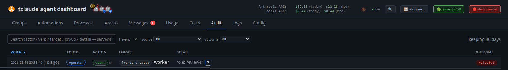

# Permissions and audit

Running many agents seriously means giving them real autonomy without losing
the ability to answer, later, exactly who did what and under which authority.
tclaude's answer is a single choke point: every mutating `tclaude agent`
action — from the CLI or the dashboard — goes through the `agentd` daemon,
which decides the request against a permission model and writes the outcome
to an audit trail. The daemon is fail-closed: the CLI refuses to fall back to
direct database access when `agentd` is down, so killing the daemon never
bypasses authorization.

Identity is resolved from the kernel, not from tokens agents could leak or
forge — see [Agents and groups](agents-and-groups.md). A human caller passes
every gate; an agent caller is checked against permission slugs.

## The slug model

Every gated action maps to a named **permission slug**. The live registry —
about 100 slugs — is the source of truth:

```bash
tclaude agent permissions slugs
```

Slugs fall into recognizable families: `self.*` (an agent acting on itself),
`agent.*` (acting on any other agent), `groups.*` (roster and settings
administration, including `groups.members.*`, `groups.settings.*`,
`groups.link.*`, and `groups.triggers.*`), `permissions.*`, `human.*`
(channels to the operator), `message.direct`, `templates.*`, `process.*`,
`profiles.manage`, `roles.manage`, `routes.publish`/`routes.consume`,
`sandbox-profiles.*`, `triggers.*`, and `proxy.*`. Don't memorize the list;
query the registry.

An agent may perform an action when the slug appears in its **effective
set**, the union of:

- global defaults (`agent.default_permissions` in
  `~/.tclaude/data/config.json`),
- live group grants (membership policy — effective immediately, gone the
  moment the agent leaves the group),
- per-conversation grants,
- active [sudo](#sudo-time-bounded-elevation) elevations,
- grants contributed by group ownership (see below).

An explicit per-agent **deny** beats everything except sudo. If no source
supplies the slug, the request is refused.

### Managing grants

```bash
tclaude agent permissions ls                  # defaults and overrides
tclaude agent permissions ls <agent>          # effective set for one agent
tclaude agent permissions grant <agent> <slug>
tclaude agent permissions deny <agent> <slug>
tclaude agent permissions revoke <agent> <slug>
tclaude agent permissions grant default <slug>   # edit global defaults
```

`slugs` and `ls` are open reads. `grant`, `deny`, and `revoke` are themselves
gated, on `permissions.grant` and `permissions.revoke` — which in practice
keeps them human-only, since those two slugs are also blocklisted from sudo.
The magic target `default` edits the global defaults list; `deny` blocks an
otherwise-default slug for one agent; `revoke` clears either back to the
inherited state.

!!! note
    Some CLI help text still says overrides live in `~/.tclaude/config.json`.
    The real path is `~/.tclaude/data/config.json`.

### Defaults installed by setup

`tclaude setup --install-default-agent-permissions` (idempotent) grants the
self-management baseline: `self.rename`, `self.compact`, `self.interrupt`,
`self.clone`, `self.schedule`, `self.remote-control`, `self.task`, `self.pr`,
`self.tags`, `self.dir-repair`, plus `process.templates.read`.
Self-reincarnation deliberately needs no slug at all. These defaults let an
agent manage its own conversation without letting it touch anyone else's —
every cross-agent verb still needs a separate grant. See
[Spawning and lifecycle](spawning-and-lifecycle.md) for the `--target`
manager pattern and the slugs it checks.

### What ownership contributes

Owning an active group structurally contributes grants scoped to that group:
the `groups.*` roster/settings/link/attachment/nest/archive/schedule slugs
and the `groups.members.<verb>` manager slugs, plus unscoped `human.notify`
and `process.runs.read`. Ownership never confers slugs that mutate shared
configuration (`process.templates.manage`, `agent.sandbox-impl`,
`human.clipboard`, and similar). `groups set-owner-scopes` can narrow what
owning a particular group confers — it only takes reach away, never adds.

## Scoped grants

A grant can be narrowed to part of what its slug reaches:

```bash
tclaude agent permissions grant builder groups.members.spawn \
  --scope group=dev,staging
tclaude agent permissions grant lead agent.retire \
  --scope target_agent=@self-spawned
```

`--scope` takes `dim=v1,v2` and repeats for multiple dimensions. The
evaluation rules:

- Within a dimension, matchers **OR** (`group=dev,staging` matches either).
- Across dimensions, scopes **AND** (every mentioned dimension must match).
- An unmentioned dimension is unconstrained.
- Scopes union within a tier, and one unscoped row **absorbs the tier** — an
  unscoped grant of the same slug makes the scoped ones redundant.
- A non-matching scope decides nothing: the check falls through to the other
  sources, and if none passes, the request gets a 403.

The registry advertises which dimensions each slug supports (`group`,
`spawn_profile`, `process_template`, `target_agent`, and proxy-specific
dimensions). Two relational matchers exist on `agent.retire` and
`agent.standdown`: `target_agent=@self-spawned` (agents the grantee spawned)
and `@descendants` (its spawn lineage, up to 64 generations). Lineage is
recorded only for agent-initiated spawns made after the feature existed;
reincarnation preserves descendants, but a clone is not a child.

### Denies are never scoped

`permissions deny` takes no `--scope`, by design. A deny is a hole punched in
an agent's authority, and a *scoped* deny would be a hole with edges you have
to reason about: it would remove one slice while silently leaving every other
slice granted, which reads like a narrowing but isn't one. If you want an
agent to have less, grant less — use a scoped grant. A deny means "not this
agent, not this slug, regardless of what any grant says."

## How a request is decided

Putting the pieces together, one request — say agent `builder` running
`tclaude agent spawn dev` — is decided like this:

1. `agentd` resolves the caller's identity from the kernel. A human passes
   immediately; `builder` is an agent, so the gate applies.
2. The daemon collects every source that could supply
   `groups.members.spawn`: global defaults, `builder`'s group grants,
   per-conversation grants, active sudo elevations, and
   ownership-contributed grants.
3. Scoped rows count only if their scope matches this request (here, the
   `group` dimension must cover `dev`). Non-matching rows decide nothing.
4. An explicit deny on `builder` for the slug refuses the request unless an
   active sudo elevation supplies it.
5. If a source passes, the command runs and the audit row records which
   scope (if any) authorized it. If none passes, the result is a 403 — also
   recorded — unless the call carried `--ask-human`, in which case the
   human gets the last word.

`tclaude agent permissions ls <agent>` shows the effective set the daemon
would consult, and for messaging specifically,
`tclaude agent groups why-can-i-message <target>` explains which path
authorizes a send.

## Sudo: time-bounded elevation

For work that needs a slug an agent doesn't hold — and shouldn't hold
permanently — the agent requests a bounded elevation:

```bash
tclaude agent sudo request agent.stop groups.members.spawn \
  --duration 30m --reason "winding down the review team"
tclaude agent sudo ls          # my active elevations
tclaude agent sudo ls --all    # everyone's (human view)
tclaude agent sudo revoke      # end elevations early
```

Every agent-originated request raises a human-approval popup — there is no
silent path. On approval, the slugs join the agent's effective set until the
window expires or a human revokes early. Duration is capped at **1 hour**
(default 5 minutes). The permanent-escalation slugs `permissions.grant` and
`permissions.revoke` are blocklisted from sudo: the audit trail of a
time-bounded grant is the whole point of the model, and a sudo that could
mint durable grants would defeat it.

The human form `sudo request --target <agent> <slugs…>` grants proactively
with no popup — the operator's own shell is the consent. Agents cannot use
`--target`.

## Asking the human at the moment of denial

Most mutating commands accept `--ask-human <timeout>` (capped at 300s;
timeout means deny). When the permission check fails, instead of a flat 403
the daemon creates an **access request** the operator sees in the
[dashboard](dashboard.md) Messages tab, with **Approve**, **Deny**, and
**+5min** actions. The agent's command blocks until the human answers or the
timeout expires.

For exactly two slugs — `human.clipboard` and `human.notify` — the card also
offers **"Always allow for this agent"**, which persists an allow keyed to
the stable agent id (recorded as granted by `human:popup-always`). These are
the two agent-to-human channels, where "this agent may always reach me" is a
sensible durable decision; no other slug gets an always-allow shortcut. Gates
that describe a scope dimension offer a scoped variant of the same card.

## Auto-permit: pre-consenting to a human-only prompt

A few harness prompts cannot be pre-allowed at all. Claude Code's
`EnterWorktree` safety check is the clearest case: when the target worktree
lives outside the directory Claude Code manages itself, the confirmation is a
hardcoded gate that ignores allow-rules, the auto-mode classifier, and
`PreToolUse` hook approvals alike. Only a keystroke clears it — so an agent
stalls on an operation its operator is perfectly happy to have run unattended,
with no configuration anywhere that expresses that consent.

**Auto-permit** is that configuration. Opt an agent into one *named* condition
and the daemon presses the accept key when it sees exactly that dialog:

```bash
tclaude agent auto-permit ls                          # the registry + what is on
tclaude agent auto-permit on enter-worktree           # consent (self)
tclaude agent auto-permit on enter-worktree --target reviewer
tclaude agent auto-permit off enter-worktree          # withdraw
tclaude agent auto-permit log                         # what was answered, and when
```

It is off for every agent by default, and deliberately narrow:

- **Named conditions only.** The condition list is compile-time; there is no
  wildcard. For blanket acceptance, `--dangerously-skip-permissions` already
  exists and is the honest way to ask for it.
- **The pane is the gate.** Status alone never licenses a keystroke. The daemon
  reads the pane immediately before pressing, under the same lock the keystroke
  is sent under, and presses only if that condition's dialog is live on screen.
  A stale status, an already-answered prompt, or a *different* prompt that
  arrived in the meantime all result in nothing being sent. If a future Claude
  Code reworded the dialog, auto-permit would simply stop firing and the prompt
  would wait for the human, as it does today.
- **Every press is recorded.** Each auto-answer writes an audit row (actor
  `system`, verb `auto-permit.answer`, source `auto-permit`) naming the
  condition and the prompt, visible in the dashboard's **Audit** tab and via
  `auto-permit log`.

Consent is keyed to the stable agent id, so it survives a reincarnate or a
`/clear` conv rotation.

`self.auto-permit` is modelled on `human.clipboard` rather than on the other
`self.*` slugs: **not** default-granted and **not** implied by group ownership,
so it takes an explicit grant (or a per-call `--ask-human` approval). It is not
auto-grantable from the approval popup either — standing authority to
pre-answer human-only prompts should be a deliberate grant. Acting on another
agent (`--target`) uses the usual manager pattern: `agent.auto-permit`, or the
group-scoped `groups.members.auto-permit`.

## The audit trail

The daemon records a symbolic `audit_log` row for every daemon-proxied
command, from both the CLI and the dashboard: **who** ran **what** against
**which target**, when, and with what outcome. Rows are symbolic — actor,
verb, target, group, a short bounded detail — never pane content, prompts,
or subprocess output.



*An audit row recording a rejected spawn: actor, verb, target, detail, and outcome*

Three properties make the trail defensible rather than decorative:

- **Denials are recorded too.** A 403 or any other failure writes a row, so
  the trail answers "who *tried* to do what", not only "what landed". An
  agent probing for authority it doesn't have is visible.
- **Scoped authorization is attributed.** When a command passed its gate on a
  scoped grant, the row records which scope matched. "Spawned into dev"
  reads very differently once you know the same agent is barred from prod.
- **Sudo is visible.** Requests, the operator's decision, the stated reason,
  and every command executed under the elevation all land in the trail.

Browse and filter the trail in the dashboard's **Audit** tab. Retention
defaults to 30 days; set `audit.retention_days` in
`~/.tclaude/data/config.json` to keep more, or a negative value to keep
forever. The hourly sweep re-reads the config, so changes apply without a
restart — and a corrupt config skips the sweep rather than pruning against a
guessed policy.

### The exit audit

Separately from command rows, the daemon keeps an exit ledger for managed
sessions: when a pane ends, a `managed_pane.exit` row records the bounded
evidence — cause (normal exit, signal, launch failure, or disappeared), exit
code or signal, which observer saw it, and the launch phase it died in. When
the exit was requested (stop, force-stop, retire, reincarnate), the row links
back to the lifecycle command that asked for it, so a dead agent is never
just "gone": the trail distinguishes an ordered shutdown from a crash, and a
crash from a launch that never came up. Spawn failures surface this evidence
directly ("managed pane exited during startup (signal …)"), with the pane's
output tail in the dashboard's Logs tab.

Empty cause fields mean the evidence was unavailable — the ledger never
infers a cause it didn't observe.
