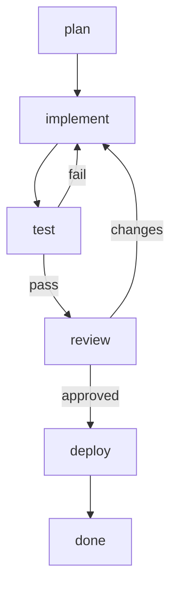

# tclaude Workflows — design

> Status: **monitoring MVP + most of the execution engine shipped to
> `agent-workflows`**; engine remainder (handoffs/loops/SLA) + Phase 3 in
> progress. Umbrella + **North-Star** doc. Per-step tracking lives on the
> **Linear board** (team JOH, project `tclaude`) — the roadmap table below
> carries current status. Started 2026-05-28 by the `agent-workflows` dev agents
> in group `tclaude-dev`.

## North Star — the bar we're building to

> Operator's framing (2026-05-30): we are aiming for a **really good workflow
> system** — expect several tests + iterations before we're there. **Robustness
> and usability are the standing priorities, over speed.** Build for the long
> term; a feature isn't done until it actually works and makes sense to use.

What "really good" means concretely — the experience to keep designing toward:

- **Templates are discoverable.** See every available workflow template at a
  glance and instantiate one in a couple of clicks.
- **Instances are legible.** For every running/finished instance, see how far it
  has got — which nodes are done / running / waiting / failed / skipped — at a
  glance, live.
- **The composition is inspectable.** Click any node to see its definition
  (executor, verification, I/O), its current status, and its audit trail. The
  mermaid graph is the map; the node detail is the territory.
- **You can zoom into the work itself.** For an AI node, watch the *individual
  agent working inside it* — live vitals, and ideally attach to what it is
  actually doing. And when an instance runs in **agent-as-engine** mode (JOH-15),
  the same for the **root coordinating agent** driving the whole graph.
- **It's robust.** Survives daemon restarts, crashed / idle agents, races, and
  human-in-the-loop gaps without losing or mis-reporting state.

Most of this maps to roadmap steps / Linear tickets below; the deepest "zoom into
the agents" observability is its own tracked thread. This section is the durable
statement of intent — keep it in view when making design calls.

## What this is

A **workflow** in tclaude is an instantiable template describing a flow of work
as a **graph**. You instantiate a template when you want that work done, and the
new **instance** is tracked — node by node — in tclaude's SQLite and monitored
live in a new **Workflows** tab in the agentd dashboard.

The point that makes this *ours* and not a clone of an existing runner:

- **The flow is a mermaid chart.** Node IDs are human-readable; edges express
  real topology — branches, joins, parallel fan-out, decision gateways, loops.
  Not a linear step list.
- **Each node is defined by a standalone YAML** keyed by its mermaid node ID.
  The chart is the topology; the YAML is the detail (who runs it, how it's
  verified, its inputs/outputs).
- **Monitoring-first.** The deliverable is a dashboard tab that renders the
  chart with live node status (colors / overlays / animations), per-node I/O
  summaries, an audit trail, and — for AI nodes — the ability to start/attach
  the agent doing the work.
- **AI nodes are tclaude agents.** We don't shell out to vendor CLIs. An AI node
  maps to a tclaude agent, and an instance can own a regular tclaude **agent
  group** so the existing spawn / attach / messaging machinery does the heavy
  lifting.
- **State in SQLite now; remote later.** Local-only implementation for now; the
  schema is designed so a remote sync backend can be added without reshaping it.

### Reference we studied (concepts only)

We studied [`Codagent-AI/agent-runner`](https://github.com/Codagent-AI/agent-runner)
("Stop giving the agent a workflow. Put the agent inside the workflow."). We
borrowed *concepts*, not architecture. Their model is a **linear nested step
list** run by a **TUI**, shelling out to vendor agent CLIs, with per-run
`state.json` + `audit.log` files. Ours is a **graph** defined in **mermaid**,
monitored in the **dashboard**, executed through **tclaude agents/groups**, with
state in **SQLite**.

Concepts we keep:

- Per-node **executor** + first-class **verification** (definition-of-done).
- **Capture** of node output into named vars + `{{var}}` interpolation, with
  type preservation (string / list / map).
- `continue_on_failure`, `skip_if`, `break_if` style flow control — re-expressed
  as graph edges + node attributes.
- **Loops** (their counted / foreach) — re-expressed as graph back-edges plus a
  per-node retry/iteration count.
- **Resumable per-node state** — natural in SQLite; an instance survives daemon
  restarts.
- **Audit trail** of state transitions — an events table, not a flat file.
- Discovery from **project + user dirs + one shipped example** (theirs: embedded
  built-ins; ours: a single `go:embed` example).

Concepts we drop / defer: their linear step model, the engine-plugin
abstraction, multi-vendor CLI adapters (tclaude agents are the AI executor),
and named-session `new/resume/inherit` (revisited in Phase 2 group integration).

## The template format

A template is **user data**, discovered from disk (not shipped, except one
example). Resolution order (project shadows user shadows built-in):

1. Project: `<repo>/.tclaude/workflows/<name>/`
2. User: `~/.tclaude/workflows/<name>/`
3. Built-in example: embedded via `go:embed`, referenced as `example:<name>`.

A template is a **directory** so the mermaid stays a pure, separately-renderable
file (GitHub / editors / mermaid-live preview it as-is):

```
<name>/
  workflow.yaml      # metadata: name, description, params, entry node(s)
  flow.mmd           # the mermaid flowchart — PURE mermaid, node ids = keys below
  nodes/
    <node-id>.yaml   # one file per node; filename (sans .yaml) == mermaid node id
```

`workflow.yaml`:

```yaml
name: implement-microservice
description: Stand up a new micro-service in our env, end to end.
params:
  - name: service_name
    required: true
  - name: env
    default: staging
entry: plan            # node id(s) that start in `ready`. optional; inferred as
                       # the nodes with no incoming edges if omitted.
```

`flow.mmd` — topology only, human-readable ids, labeled edges for branches:



`nodes/<id>.yaml` — the per-node detail:

```yaml
# nodes/implement.yaml
label: Implement the service
executor:
  kind: ai                # human | ai | tool | program  (see "mix" note below)
  agent: implementor      # ai: profile/role hint for the spawned agent
  mode: autonomous        # ai: interactive | autonomous
  prompt: |
    Implement {{service_name}} following the plan in {{plan.output}}.
verify:
  kind: tool              # none | human | ai | tool | program | enum | format
  run: go test ./...      # tool/program: command; exit 0 = pass
capture: impl_notes       # name to store this node's output under (optional)
retries: 0                # max re-runs on failure before the node is `failed`
on_fail: stop             # stop | continue  (continue = follow `|fail|` edge)
```

### Node model

Each node has exactly **one executor** and **one verification**:

**`executor.kind`:**

| kind      | meaning                                                            | key fields |
|-----------|-------------------------------------------------------------------|------------|
| `human`   | a person does it; dashboard shows instructions; person marks done | `instructions` |
| `ai`      | a tclaude agent does it (Phase 2: auto-spawn into the instance group; MVP: shows prompt, human associates/marks) | `agent`, `mode`, `prompt`, `group` |
| `tool`    | run a command, capture output; exit code is the signal            | `run`, `workdir`, `capture` |
| `program` | like `tool` but a longer-running / managed program                | `run`, `workdir` |

> **"mix"** from the brief is modeled as *executor of one kind + verification by
> a different party* (e.g. `ai` executes, `human` verifies). That covers the
> common case without a true multi-executor node. Genuinely multi-party nodes
> should be decomposed into multiple nodes.

**`verify.kind`** — the definition-of-done:

| kind      | passes when…                                                       |
|-----------|--------------------------------------------------------------------|
| `none`    | the executor reports completion                                    |
| `human`   | a human approves via the dashboard                                 |
| `tool` / `program` | a command exits 0 (optionally output matches)             |
| `ai`      | an AI judge agent rules the output acceptable                      |
| `enum`    | the produced value ∈ a declared set — **and the value selects the outgoing edge** |
| `format`  | the output matches a regex / schema                                |

### Branching — the elegant bit

A node whose verification produces an **outcome value** selects which outgoing
edge to follow by **matching the mermaid edge label**:

```mermaid
review -->|approved| deploy
review -->|changes|  implement
```

`review` is `verify.kind: enum` with `values: [approved, changes]`; the produced
value picks the edge. Unlabeled edges are the default/success path. A reserved
`|fail|` label is followed when a node fails and `on_fail: continue`. Multiple
unlabeled outgoing edges = **parallel fan-out** (all successors become `ready`).
A node with multiple incoming edges is a **join** (becomes `ready` per its
`join:` policy — `all` predecessors done, or `any`).

### Loops

A back-edge in the graph (e.g. `test -->|fail| implement`) *is* a loop. To bound
it, nodes carry `retries:` (re-run this node) and the instance tracks a per-node
visit count; a `max_visits` guard on a node prevents runaway cycles.

## Instance state (SQLite)

Templates live on disk; **instances and per-node state live in SQLite**. On
instantiation we **snapshot** the resolved mermaid + node defs into the instance
so later edits to the template file never corrupt a running instance (agent-
runner uses a workflow hash; we snapshot fully). Tables (full DDL in
`workflows-db-schema.md`):

- `workflow_instances` — one row per instantiation: `template_ref`, `title`,
  `status` (running/completed/failed/cancelled), `mermaid` snapshot, `params`
  JSON, `vars` JSON (captured values), optional `group_id`, timestamps.
- `workflow_nodes` — one row per node per instance: `node_id`, `label`,
  `executor_kind`, `status` (pending/ready/running/awaiting_verify/done/failed/
  skipped), `outcome` (the enum value chosen), `detail` (node-def snapshot JSON),
  `output` (captured I/O summary), `assignee` (agent conv id / human),
  timestamps. `UNIQUE(instance_id, node_id)`.
- `workflow_events` — append-only audit/timeline: `instance_id`, `node_id`,
  `kind`, `message`, `at`. Backs the per-node "open audit data" context-menu
  action and the instance timeline.

Node status lifecycle:

```
pending ──(predecessors satisfied)──▶ ready ──▶ running ──▶ awaiting_verify ──▶ done
                                                   │                              │
                                                   └──────────▶ failed ◀──────────┘
branch not taken ──▶ skipped
```

## Group integration (the tclaude angle)

The human's idea: **each workflow instance may own a regular tclaude agent
group**. This is how we get execution + attach "for free":

- Instantiating a workflow optionally creates a group (named after the instance).
- An **AI node** spawns an agent **into that group** (reusing `groups.spawn` +
  the existing spawn machinery), or messages an existing member. The node's
  `assignee` stores that agent's conv id.
- The dashboard's **"attach"** action on a node attaches to that agent's tmux
  session (tclaude already attaches to sessions); **"start"** spawns the agent
  if the node is `ready` and unstarted.
- This unifies workflow monitoring with the existing Groups tab and inbox.

MVP keeps this light (pre-create/link a group, allow manual agent association,
support attach); full auto-spawn-per-node orchestration is Phase 2
(`workflows-execution-engine.md`).

## Dashboard "Workflows" tab

Live monitoring (rides the existing 2s `/api/snapshot` poll). Two panels:

- **Templates** — discovered templates as cards/rows; "Instantiate" opens a
  modal (pick template, title, params) → `POST /api/workflows`.
- **Instances** — running + historical, with status and progress (e.g. 4/8 nodes
  done). Click → instance detail.

**Instance detail:**

- **Rendered mermaid** with live node state shown via **colors, overlays, and
  animations** (vendored `mermaid.min.js` — first diagram lib in the dashboard):
  - status color per node via injected `classDef`/`class` directives
    (`done`=green, `running`=blue + **pulse animation**, `failed`=red,
    `awaiting_verify`=amber, `skipped`=grey, `pending`=dim);
  - the active edge animated (stroke-dash march);
  - small **status badge overlays** positioned over node bounding boxes;
  - re-render (or restyle) on each 2s snapshot.
- **Per-node I/O summary** — inputs (interpolated params/captures) and the
  captured output, expandable.
- **Context menu** per node: *open audit data* (the `workflow_events` for that
  node), and for AI nodes *start* / *attach* the agent.

See `workflows-dashboard-tab.md` for the mermaid-status rendering approach in
detail (mermaid only currently styles via classDef/class; animations + overlays
are layered on with CSS keyframes and absolutely-positioned badges keyed off the
SVG `g.node` ids).

## agentd HTTP API

Mirrors the cron/template handler patterns (auth via `checkDashboardAuth`, JSON
via `writeJSON`, routes registered in `dashboard_edit.go`). See
`workflows-agentd-api.md`:

- `GET /api/snapshot` — gains `workflows` (instances summary) + `workflow_templates`.
- `POST /api/workflows` — instantiate (`{template_ref, title, params}`).
- `GET /api/workflows/{id}` — full instance detail (nodes, vars, events, mermaid).
- `PATCH /api/workflows/{id}/nodes/{nodeId}` — update node status/outcome/output
  (manual driving in the MVP; the engine drives it in Phase 2).
- `POST /api/workflows/{id}/nodes/{nodeId}/{start|attach}` — agent lifecycle.
- `GET /api/workflows/{id}/nodes/{nodeId}/audit` — events for a node.
- `POST /api/workflows/{id}/cancel`, `DELETE /api/workflows/{id}`.

## Phasing

**Phase 1 — Monitoring MVP (high-prio):**
template format + parser/validator + example · SQLite schema + CRUD · agentd
endpoints · Workflows tab (templates + instances + mermaid-status render + node
I/O + audit context-menu) · manual node-driving + attach to associated agents.
You can author a workflow, instantiate it, drive it by hand, and watch it live.

**Phase 2 — Execution engine (med-prio):**
auto-advance the graph · spawn AI-node agents into the instance group · run
tool/program nodes · run verifications (tool/ai/enum/format) · capture +
`{{interpolation}}` · retries/loops/joins. The runner becomes autonomous.
(Prior art for the verify/review loops, rate-limit handling and session-driving:
the old `pkg/claude/task` runner — linear/single-agent, but the loop mechanics
are reusable.)

**Phase 2 — External template sources (med-prio):**
reference templates by `dir:<path>` or `git:<url>@<ref>#<path>`, so any repo can
host workflows. The `source:name` ref scheme already anticipates this.

**Phase 3 — advanced (future):** composite nodes (multi-task + success rules,
`workflows-composite-nodes.md`) and dynamic sub-graphs (sub-workflow nodes +
runtime fan-out/expansion, `workflows-dynamic-subgraphs.md`).

**Folded into earlier steps** (from `workflows-ideas.md`): static graph analysis
(its own high-prio step), live agent vitals on nodes (Steps 4–5), stuck/SLA
escalation + inbox handoffs (Step 6), node approval gates (Step 4).

**Future:** remote state sync backend; richer verification engines.

## Roadmap — ordered build sequence (don't lose work on restart)

Dependency- and priority-ordered. This table is the authority on *order*; the
TODO tier dirs are a secondary signal. The PO keeps `Status` current.

| #  | Step                                                | Linear  | Status                                                                                  | Depends on |
|----|-----------------------------------------------------|---------|-----------------------------------------------------------------------------------------|------------|
| 1  | Template format + parser + example                  | —       | ✅ done (#226)                                                                          | —          |
| 2  | SQLite schema + CRUD                                 | —       | ✅ done (#227; schema now v49 after main merges)                                        | 1          |
| 2b | Static graph analysis (validator) — *parallel*      | —       | ✅ done (#228)                                                                          | 1          |
| 3  | agentd HTTP API + snapshot                          | —       | ✅ done (#230)                                                                          | 1, 2       |
| 4  | Group integration (+ live vitals, approval gates)   | —       | ✅ done (#234)                                                                          | 3          |
| 5  | Dashboard tab (+ live vitals overlay) — *∥ with 4*  | —       | ✅ done (#233, + #235 hardening)                                                        | 3          |
| —  | **← monitoring MVP complete; operator review here** |         | ✅ reached                                                                              | 4, 5       |
| 6  | Execution engine (+ stuck/SLA, inbox handoffs)      | JOH-8   | 🔨 wip — slices A #239, B #243, C #251 (JOH-35) done; remainder **JOH-40/39/41**         | 1–5        |
| 7  | External `dir:`/`git:` template sources             | JOH-12  | ✅ done (#236)                                                                          | 1 (+gates) |
| 8  | Composite nodes (multi-task + success rules)        | JOH-14  | ⏳ queued (blocked by Step 6)                                                           | 6          |
| 9  | Sub-workflow nodes + dynamic sub-graphs             | JOH-16  | ⏳ queued (blocked by Steps 6, 8)                                                       | 6, 8       |
| 10 | `tclaude workflow` CLI (agent↔engine reflection ⭐) | JOH-13  | ✅ done (#238 + #245 + #247)                                                            | 3          |
| 11 | Agent-as-engine (opt-in)                            | JOH-15  | ⏳ queued — Part A ~shipped (CLI #238/#245/#247 + skill #249/JOH-38); Part B remaining   | 6, 10      |

> **Agent ↔ engine interop (Steps 10–11) is operator-flagged super-important.** Step 10 (the
> `tclaude workflow` CLI reflection surface) + the bundled `workflow-node` skill (JOH-38) have
> shipped; the deepest "zoom into the agents working inside nodes" observability (North Star)
> and the opt-in agent-as-engine mode (JOH-15 Part B) are the remaining frontier.

⭐ The agent↔engine **reflection/interop** (steps 10–11) is operator-flagged
super-important and buildable right after Step 3 — pull forward if wanted sooner.
Steps 8–11 are sequenced at the end per the operator.

Idea backlog (unscheduled): `TODO/future/workflows-ideas.md`.

---

> ⚠️ **The sections below are HISTORICAL working/handoff logs** from mid-flight
> states that are now all resolved. They are kept for record only. **For current
> status, use the roadmap table + North Star above and the Linear board.** Do not
> trust the PR numbers / "active" / "wip" claims below as current.

## ⟳ REINCARNATION HANDOFF (2026-05-30, ~15:30) — historical

The previous PO instance hit context rot (fabricated a non-existent "PR #233",
mis-attributed Step-4 progress reports to `wf-main-merge`, and replied to messages
that were never sent). Operator authorized a reincarnate even though context was
only 22% (~224k/1M) — the *error rate*, not the token count, was the trigger.
**Do not trust the prior PO's recent inbox replies (#60, #61, #64, and the bogus
"PR #233" cold-review/gate run).** Re-derive state from git + `gh` + this doc.

**VERIFIED GROUND TRUTH at handoff (re-confirm before acting):**
- `origin/agent-workflows` tip = `aeec048` (Step 3 + main merged; schema v48).
- Open PRs: **#225** (rollup agent-workflows→main, DRAFT) and #223 (unrelated). **There is NO PR for Step 4 or Step 5 yet.**
- **Steps 4 & 5 have real local commits but have NOT pushed / opened PRs and have NOT messaged the PO:**
  - `wf-group-integration` (878d3cd5) — local branch `workflows-group-integration` tip `3ff97a0` "group binding, start/attach, human-approve gate (Step 4)", 1 commit ahead of `aeec048`. NOT on origin.
  - `wf-dashboard-tab` (e01d3f10) — local branch `workflows-dashboard-tab` tip `60d4a08` "dashboard Workflows tab + live vitals overlay (Step 5)", 1 commit ahead of `aeec048`. NOT on origin.
- `wf-main-merge` (28338c59): task DONE + merged (#232). Idle/parked. Standing owner for `pkg/claude/common/db` migration/schema work (v49+) and agent-workflows↔main lineage. **It did ZERO Step-4 work** — never route Step-4 traffic to it.
- Other idle/parked: `wf-agentd-api` (2489beb5, owns Step 3 → will own Step 6 engine), `wf-graph-analysis2` (ebc65cd7, validator/graph context).

**FIRST ACTIONS on resume:**
1. `tclaude agent inbox ls` — handle any genuinely-new worker reports (verify sender identity; the prior PO confused senders).
2. For Step 4 & 5: they likely just need to push their branches + open PRs into `agent-workflows`. Ping the ACTUAL agents (878d3cd5, e01d3f10) — ask them to push + open PR, or confirm status. Do NOT assume progress you haven't seen on-wire.
3. Per step PR: independent cold review (CodeRabbit skips) + `go build/test/lint` on its head, then squash-merge via API into `agent-workflows`, `pull --rebase`, flip the roadmap row.
4. When BOTH 4 & 5 land → monitoring MVP complete → tell the operator it's testable (their review checkpoint for PR #225).
5. Outstanding cross-dep: Step 4 was asked (msg #54) to add `warnings[]` to `dashboardWorkflowTemplate` + the `GET /api/workflows/{id}` detail, and to expose `executor.Agent` as `agent` in `workflowNodeJSON` (Step 5 feature-detects both).

**Operating discipline (the rot was process, not just tokens):** read each inbound
message and let the result return BEFORE composing any reply — never batch a read
with the dependent reply/action (see memory `feedback-read-before-batching`). Poll
`tclaude agent context-info`; reincarnate well before 300k, or sooner if error rate
climbs (memory `po-context-reincarnate`).

---

## ✎ PO RESUME — corrections to the handoff above (2026-05-30 ~15:35)

New PO instance (`8ce5ef43`) re-derived state on-wire. The handoff block above is
mostly right but has **two errors — trust this section over it:**

- **"PR #233 is fabricated" is WRONG.** PR **#233 is real**: Step 5
  (`wf-dashboard-tab`, e01d3f10), base `agent-workflows`, **OPEN / non-draft /
  MERGEABLE-CLEAN**, head `481c775` (branch `workflows-dashboard-tab`, pushed).
  Created 13:32, ~2h *before* the handoff — so it existed at handoff time; the
  dying PO mis-stated it. Step 5 reported done (msg #70): front-end only, **touches
  ZERO shared .go files**, gates green locally, ran its own cold review. Independent
  of Step 4 — no merge-order dep.
- **`origin/agent-workflows` tip is `1ce2d28`**, not `aeec048` (the handoff doc
  commit got pushed). Local == origin, clean.

**Verified state at resume:**
- **Step 5 / PR #233** — OPEN, ready. CodeRabbit check SUCCESS but **reviews:0 =
  skip, not a review.** PO launched an independent blind cold review + fresh
  build/test/lint on head `481c775` (running). Clean → squash-merge into
  `agent-workflows`. Note: `ci.yml` only runs on PRs→`main`, so GitHub won't gate
  an `agent-workflows`-targeted PR (same as #227–#233) — **local gates are the
  authority.**
- **Step 4 / `wf-group-integration` (878d3cd5)** — still **NOT on origin, no PR**
  (re-confirmed via `git ls-remote` + `gh`). PO pinged it (msg #72) to rebase onto
  `1ce2d28`, push, open a PR into `agent-workflows`, and carry the #54 cross-dep
  (`warnings[]` on `dashboardWorkflowTemplate` + the GET detail; expose
  `executor.Agent` as `agent` in `workflowNodeJSON`). Awaiting its PR #.
- When BOTH 4 & 5 land → monitoring MVP complete → tell the operator it's testable
  (their checkpoint for rollup PR #225).

---

## ▶ RESUMED — Step 3 merged; Steps 4 & 5 active (2026-05-30)

Resumed after the travel pause. **PR #230 merged** into `agent-workflows` (squash
`0304725`) after: `wf-agentd-api` fixed two real bugs its own cold review caught
(reachability-based `JoinAll` rewrite + terminal/re-settle guards, commit
`72f6711`); PO re-ran gates uncached (build/test/lint all green) and ran one fresh
blind cold review of the final diff (verdict: merge as-is, only LOW findings).
Steps 4 & 5 unblocked and re-briefed against the **real** contract below.

**`main` merged in** (PR #232, merge commit `6f5aaa4`): main's PR #231 (`sessions.model`)
collided with our workflows migration on **v47**. Resolved by keeping main's v47
canonical (it's deployed/already-run) and renumbering the workflows tables to **v48**
(`migrateV47toV48`; current max schema version = 48). Kept as a true merge commit so the
rollup PR #225 (agent-workflows→main) stays clean. Steps 4 & 5 rebase onto this base.
(`wf-db-schema` was pruned by the operator, so a fresh `wf-main-merge` agent did this.)

**Track for Step 6 (engine), from the #230 cold review — not blockers now:**
- **Concurrency:** the node-PATCH read-modify-write has no per-instance lock; fine
  for today's single-human dashboard, but the engine will be the concurrent driver
  — add a per-instance mutex / `WHERE status='pending'`-guarded update then.
- **Manual-skip escape hatch:** a manual PATCH to `skipped`/`pending` can strand a
  sub-tree (skip doesn't run `Advance`); consider restricting manual status to
  running/done/failed and routing skip through cancel.

**Contract recon (verified by the workers; this is what the re-briefs use):**
- **Lists live in the main snapshot, not separate endpoints.** Step 3 adds
  `snapshotPayload.workflows` + `.workflow_templates`, served by `GET /api/snapshot`
  (the frontend already polls it every 2s). Detail = `GET /api/workflows/{id}` →
  `{instance, mermaid, params, vars, nodes[], events[]}`. Mutations: `POST /api/workflows`
  (`{template_ref, title, params}`), `PATCH .../nodes/{id}` (advance), `POST .../cancel`,
  `DELETE .../{id}`, `GET .../nodes/{id}/audit`. `start`/`attach` 501 → Step 4.
- **No `GroupSummary` needed — the data already exists.** Instances carry
  `group_id`/`group_name`; the existing `snapshot.groups[].members[]` already has
  `online` + `state.status` (idle/working/awaiting) + `status_detail`. The vitals
  overlay can match a node's runtime `assignee` to a group member **today**, no Step 4
  dependency for the core; degrade to "no agent bound" when empty. (So the pinned
  `GroupSummary` contract in the old briefs is moot — drop it.) Caveat: `workflowNodeJSON`
  exposes `assignee` + `executor_kind` but NOT the template's declared `executor.Agent`
  hint — a *pre-binding* "intended role" label needs that field exposed (small Step 4
  backend add). This also answers Step 4's open Q (#4 above): the agent hint comes from
  the template's `executor.Agent`, currently not surfaced.
- **Mermaid offline-vendoring gotcha:** v11/v10 UMD `mermaid.min.js` lazy-loads diagram
  chunks via dynamic `import()` → breaks as a single self-hosted file. **v9.4.3 UMD
  (~2.7MB) is fully self-contained** and renders flowcharts offline via `window.mermaid`.
  Vendor 9.4.3 for the "no CDN, single file" requirement (or vendor the chunk dir too).

As each ships, move its TODO file to `docs/plans/DONE/` and rewrite the body to
describe what shipped (API surface, schema version, file paths, test scenarios,
commit refs). Workers do this for their own step; the PO keeps the table current.

## Open questions

- Template format: directory (chosen above) vs single-file (`mermaid:` inline +
  `nodes:` map). Directory keeps `.mmd` pure/previewable; revisit if authoring
  friction shows up.
- Group-per-instance: always, opt-in, or only when a workflow has ≥1 AI node?
- How much of the mermaid flowchart grammar do we parse? Start with a documented
  subset (`flowchart`/`graph` TD/LR/etc., `A`, `A[txt]`, `A{txt}`, `A((txt))`,
  `A --> B`, `A -->|label| B`); reject the rest with a clear error.
