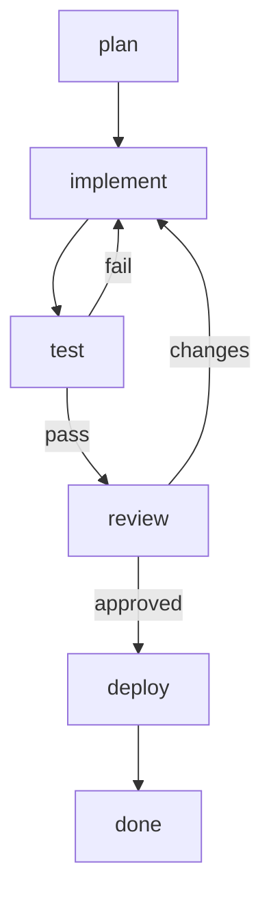

# tclaude Workflows — design

> Status: **design / in progress**. Umbrella doc. Per-step work lives in
> `docs/plans/TODO/high-prio/workflows-*.md` (and `med-prio/` for Phase 2).
> Started 2026-05-28 by the `agent-workflows` dev agent in group `tclaude-dev`.

## What this is

A **workflow** in tclaude is an instantiable template describing a flow of work
as a **graph**. You instantiate a template when you want that work done, and the
new **instance** is tracked — node by node — in tclaude's SQLite and monitored
live in a new **Workflows** tab in the agentd dashboard.

The point that makes this *ours* and not a clone of an existing runner:

- **The flow is a mermaid chart.** Node IDs are human-readable; edges express
  real topology — branches, joins, parallel fan-out, decision gateways, loops.
  Not a linear step list.
- **Each node is defined by a standalone YAML** keyed by its mermaid node ID.
  The chart is the topology; the YAML is the detail (who runs it, how it's
  verified, its inputs/outputs).
- **Monitoring-first.** The deliverable is a dashboard tab that renders the
  chart with live node status (colors / overlays / animations), per-node I/O
  summaries, an audit trail, and — for AI nodes — the ability to start/attach
  the agent doing the work.
- **AI nodes are tclaude agents.** We don't shell out to vendor CLIs. An AI node
  maps to a tclaude agent, and an instance can own a regular tclaude **agent
  group** so the existing spawn / attach / messaging machinery does the heavy
  lifting.
- **State in SQLite now; remote later.** Local-only implementation for now; the
  schema is designed so a remote sync backend can be added without reshaping it.

### Reference we studied (concepts only)

We studied [`Codagent-AI/agent-runner`](https://github.com/Codagent-AI/agent-runner)
("Stop giving the agent a workflow. Put the agent inside the workflow."). We
borrowed *concepts*, not architecture. Their model is a **linear nested step
list** run by a **TUI**, shelling out to vendor agent CLIs, with per-run
`state.json` + `audit.log` files. Ours is a **graph** defined in **mermaid**,
monitored in the **dashboard**, executed through **tclaude agents/groups**, with
state in **SQLite**.

Concepts we keep:

- Per-node **executor** + first-class **verification** (definition-of-done).
- **Capture** of node output into named vars + `{{var}}` interpolation, with
  type preservation (string / list / map).
- `continue_on_failure`, `skip_if`, `break_if` style flow control — re-expressed
  as graph edges + node attributes.
- **Loops** (their counted / foreach) — re-expressed as graph back-edges plus a
  per-node retry/iteration count.
- **Resumable per-node state** — natural in SQLite; an instance survives daemon
  restarts.
- **Audit trail** of state transitions — an events table, not a flat file.
- Discovery from **project + user dirs + one shipped example** (theirs: embedded
  built-ins; ours: a single `go:embed` example).

Concepts we drop / defer: their linear step model, the engine-plugin
abstraction, multi-vendor CLI adapters (tclaude agents are the AI executor),
and named-session `new/resume/inherit` (revisited in Phase 2 group integration).

## The template format

A template is **user data**, discovered from disk (not shipped, except one
example). Resolution order (project shadows user shadows built-in):

1. Project: `<repo>/.tclaude/workflows/<name>/`
2. User: `~/.tclaude/workflows/<name>/`
3. Built-in example: embedded via `go:embed`, referenced as `example:<name>`.

A template is a **directory** so the mermaid stays a pure, separately-renderable
file (GitHub / editors / mermaid-live preview it as-is):

```
<name>/
  workflow.yaml      # metadata: name, description, params, entry node(s)
  flow.mmd           # the mermaid flowchart — PURE mermaid, node ids = keys below
  nodes/
    <node-id>.yaml   # one file per node; filename (sans .yaml) == mermaid node id
```

`workflow.yaml`:

```yaml
name: implement-microservice
description: Stand up a new micro-service in our env, end to end.
params:
  - name: service_name
    required: true
  - name: env
    default: staging
entry: plan            # node id(s) that start in `ready`. optional; inferred as
                       # the nodes with no incoming edges if omitted.
```

`flow.mmd` — topology only, human-readable ids, labeled edges for branches:



`nodes/<id>.yaml` — the per-node detail:

```yaml
# nodes/implement.yaml
label: Implement the service
executor:
  kind: ai                # human | ai | tool | program  (see "mix" note below)
  agent: implementor      # ai: profile/role hint for the spawned agent
  mode: autonomous        # ai: interactive | autonomous
  prompt: |
    Implement {{service_name}} following the plan in {{plan.output}}.
verify:
  kind: tool              # none | human | ai | tool | program | enum | format
  run: go test ./...      # tool/program: command; exit 0 = pass
capture: impl_notes       # name to store this node's output under (optional)
retries: 0                # max re-runs on failure before the node is `failed`
on_fail: stop             # stop | continue  (continue = follow `|fail|` edge)
```

### Node model

Each node has exactly **one executor** and **one verification**:

**`executor.kind`:**

| kind      | meaning                                                            | key fields |
|-----------|-------------------------------------------------------------------|------------|
| `human`   | a person does it; dashboard shows instructions; person marks done | `instructions` |
| `ai`      | a tclaude agent does it (Phase 2: auto-spawn into the instance group; MVP: shows prompt, human associates/marks) | `agent`, `mode`, `prompt`, `group` |
| `tool`    | run a command, capture output; exit code is the signal            | `run`, `workdir`, `capture` |
| `program` | like `tool` but a longer-running / managed program                | `run`, `workdir` |

> **"mix"** from the brief is modeled as *executor of one kind + verification by
> a different party* (e.g. `ai` executes, `human` verifies). That covers the
> common case without a true multi-executor node. Genuinely multi-party nodes
> should be decomposed into multiple nodes.

**`verify.kind`** — the definition-of-done:

| kind      | passes when…                                                       |
|-----------|--------------------------------------------------------------------|
| `none`    | the executor reports completion                                    |
| `human`   | a human approves via the dashboard                                 |
| `tool` / `program` | a command exits 0 (optionally output matches)             |
| `ai`      | an AI judge agent rules the output acceptable                      |
| `enum`    | the produced value ∈ a declared set — **and the value selects the outgoing edge** |
| `format`  | the output matches a regex / schema                                |

### Branching — the elegant bit

A node whose verification produces an **outcome value** selects which outgoing
edge to follow by **matching the mermaid edge label**:

```mermaid
review -->|approved| deploy
review -->|changes|  implement
```

`review` is `verify.kind: enum` with `values: [approved, changes]`; the produced
value picks the edge. Unlabeled edges are the default/success path. A reserved
`|fail|` label is followed when a node fails and `on_fail: continue`. Multiple
unlabeled outgoing edges = **parallel fan-out** (all successors become `ready`).
A node with multiple incoming edges is a **join** (becomes `ready` per its
`join:` policy — `all` predecessors done, or `any`).

### Loops

A back-edge in the graph (e.g. `test -->|fail| implement`) *is* a loop. To bound
it, nodes carry `retries:` (re-run this node) and the instance tracks a per-node
visit count; a `max_visits` guard on a node prevents runaway cycles.

## Instance state (SQLite)

Templates live on disk; **instances and per-node state live in SQLite**. On
instantiation we **snapshot** the resolved mermaid + node defs into the instance
so later edits to the template file never corrupt a running instance (agent-
runner uses a workflow hash; we snapshot fully). Tables (full DDL in
`workflows-db-schema.md`):

- `workflow_instances` — one row per instantiation: `template_ref`, `title`,
  `status` (running/completed/failed/cancelled), `mermaid` snapshot, `params`
  JSON, `vars` JSON (captured values), optional `group_id`, timestamps.
- `workflow_nodes` — one row per node per instance: `node_id`, `label`,
  `executor_kind`, `status` (pending/ready/running/awaiting_verify/done/failed/
  skipped), `outcome` (the enum value chosen), `detail` (node-def snapshot JSON),
  `output` (captured I/O summary), `assignee` (agent conv id / human),
  timestamps. `UNIQUE(instance_id, node_id)`.
- `workflow_events` — append-only audit/timeline: `instance_id`, `node_id`,
  `kind`, `message`, `at`. Backs the per-node "open audit data" context-menu
  action and the instance timeline.

Node status lifecycle:

```
pending ──(predecessors satisfied)──▶ ready ──▶ running ──▶ awaiting_verify ──▶ done
                                                   │                              │
                                                   └──────────▶ failed ◀──────────┘
branch not taken ──▶ skipped
```

## Group integration (the tclaude angle)

The human's idea: **each workflow instance may own a regular tclaude agent
group**. This is how we get execution + attach "for free":

- Instantiating a workflow optionally creates a group (named after the instance).
- An **AI node** spawns an agent **into that group** (reusing `groups.spawn` +
  the existing spawn machinery), or messages an existing member. The node's
  `assignee` stores that agent's conv id.
- The dashboard's **"attach"** action on a node attaches to that agent's tmux
  session (tclaude already attaches to sessions); **"start"** spawns the agent
  if the node is `ready` and unstarted.
- This unifies workflow monitoring with the existing Groups tab and inbox.

MVP keeps this light (pre-create/link a group, allow manual agent association,
support attach); full auto-spawn-per-node orchestration is Phase 2
(`workflows-execution-engine.md`).

## Dashboard "Workflows" tab

Live monitoring (rides the existing 2s `/api/snapshot` poll). Two panels:

- **Templates** — discovered templates as cards/rows; "Instantiate" opens a
  modal (pick template, title, params) → `POST /api/workflows`.
- **Instances** — running + historical, with status and progress (e.g. 4/8 nodes
  done). Click → instance detail.

**Instance detail:**

- **Rendered mermaid** with live node state shown via **colors, overlays, and
  animations** (vendored `mermaid.min.js` — first diagram lib in the dashboard):
  - status color per node via injected `classDef`/`class` directives
    (`done`=green, `running`=blue + **pulse animation**, `failed`=red,
    `awaiting_verify`=amber, `skipped`=grey, `pending`=dim);
  - the active edge animated (stroke-dash march);
  - small **status badge overlays** positioned over node bounding boxes;
  - re-render (or restyle) on each 2s snapshot.
- **Per-node I/O summary** — inputs (interpolated params/captures) and the
  captured output, expandable.
- **Context menu** per node: *open audit data* (the `workflow_events` for that
  node), and for AI nodes *start* / *attach* the agent.

See `workflows-dashboard-tab.md` for the mermaid-status rendering approach in
detail (mermaid only currently styles via classDef/class; animations + overlays
are layered on with CSS keyframes and absolutely-positioned badges keyed off the
SVG `g.node` ids).

## agentd HTTP API

Mirrors the cron/template handler patterns (auth via `checkDashboardAuth`, JSON
via `writeJSON`, routes registered in `dashboard_edit.go`). See
`workflows-agentd-api.md`:

- `GET /api/snapshot` — gains `workflows` (instances summary) + `workflow_templates`.
- `POST /api/workflows` — instantiate (`{template_ref, title, params}`).
- `GET /api/workflows/{id}` — full instance detail (nodes, vars, events, mermaid).
- `PATCH /api/workflows/{id}/nodes/{nodeId}` — update node status/outcome/output
  (manual driving in the MVP; the engine drives it in Phase 2).
- `POST /api/workflows/{id}/nodes/{nodeId}/{start|attach}` — agent lifecycle.
- `GET /api/workflows/{id}/nodes/{nodeId}/audit` — events for a node.
- `POST /api/workflows/{id}/cancel`, `DELETE /api/workflows/{id}`.

## Phasing

**Phase 1 — Monitoring MVP (high-prio):**
template format + parser/validator + example · SQLite schema + CRUD · agentd
endpoints · Workflows tab (templates + instances + mermaid-status render + node
I/O + audit context-menu) · manual node-driving + attach to associated agents.
You can author a workflow, instantiate it, drive it by hand, and watch it live.

**Phase 2 — Execution engine (med-prio):**
auto-advance the graph · spawn AI-node agents into the instance group · run
tool/program nodes · run verifications (tool/ai/enum/format) · capture +
`{{interpolation}}` · retries/loops/joins. The runner becomes autonomous.

**Future:** remote state sync backend; richer verification engines.

## Per-step docs (don't lose work on restart)

- `TODO/high-prio/workflows-template-format.md`
- `TODO/high-prio/workflows-db-schema.md`
- `TODO/high-prio/workflows-agentd-api.md`
- `TODO/high-prio/workflows-group-integration.md`
- `TODO/high-prio/workflows-dashboard-tab.md`
- `TODO/med-prio/workflows-execution-engine.md`

As each ships, move its file to `docs/plans/DONE/` and rewrite the body to
describe what shipped (CLI/API surface, schema migration version, file paths,
test scenarios, commit refs).

## Open questions

- Template format: directory (chosen above) vs single-file (`mermaid:` inline +
  `nodes:` map). Directory keeps `.mmd` pure/previewable; revisit if authoring
  friction shows up.
- Group-per-instance: always, opt-in, or only when a workflow has ≥1 AI node?
- How much of the mermaid flowchart grammar do we parse? Start with a documented
  subset (`flowchart`/`graph` TD/LR/etc., `A`, `A[txt]`, `A{txt}`, `A((txt))`,
  `A --> B`, `A -->|label| B`); reject the rest with a clear error.
