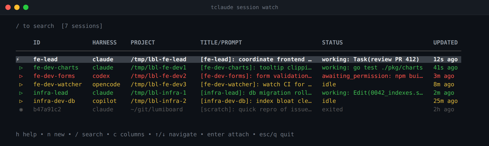

# Sessions

A session is a live tmux instance running a coding harness (or a plain
shell). tclaude launches the harness inside its own tmux server (`-L
tclaude`), tracks the session's status through harness hooks, and lets you
detach, reattach, watch, and kill sessions from anywhere. The durable
transcript behind a session is a [conversation](conversations.md) — it
outlives the tmux process and stays resumable after the session exits.

## Launching a session

Bare `tclaude` starts a new coding session in the current directory. It takes
the same flags as the underlying `tclaude session new`:

```bash
# New session in the current directory
tclaude

# Pick the harness explicitly
tclaude --harness codex
tclaude session new --harness opencode

# In another directory, with a label
tclaude session new -C /path/to/project --label review

# Start detached (don't attach)
tclaude -d
```

`--harness` accepts `claude`, `codex`, `opencode`, `copilot`, and `shell`.
When unset, the harness (and model/effort) come from the global default spawn
profile (dashboard, or `tclaude agent profiles default set`); explicit
`--harness`, `--model`, or `--effort` flags win per field. Without a global
profile, tclaude picks an installed harness from `PATH`, preferring Claude
Code. Per-harness knobs — models, effort, sandbox and approval flags — are
covered in [Harnesses](harnesses.md).

Sessions attach immediately by default; detach with `Ctrl+B D`. Useful launch
flags beyond the basics:

- `-d/--detached` starts the session without attaching.
- `--trust-dir` pre-trusts the launch directory so a detached pane doesn't
  freeze on the harness's trust-folder dialog. It edits that harness's own
  config (Claude Code's `~/.claude.json`, Codex's `~/.codex/config.toml`,
  Copilot's trusted-folders list), so it is opt-in. Applies to Claude Code,
  Codex, and Copilot.
- `-w/--wait-for-rate-limit` waits for the 5-hour and 7-day rate-limit
  windows to reset before starting — handy for queueing a session to launch
  when quota returns.
- `-r/--resume <conv-id>` relaunches an existing conversation (see
  [resume posture](#a-resume-keeps-its-recorded-posture) below).
- `-l/--label` names the tmux session; `-n/--name` sets the display name
  (for Claude Code it becomes the conversation title).

## Group auto-join on launch

A fresh terminal launch checks whether an active agent group's configured
default directory exactly matches the launch directory (both normalized and
symlink-resolved). If one does, tclaude spawns through the `agentd` daemon
into that group — with agent identity, permissions, and messaging — and
attaches. Setting a group's default directory in the dashboard makes this the
whole workflow:

```bash
cd /path/to/project
tclaude          # joins the project's group automatically
```

Controls:

- `--auto-join-group` — the directory matching described above. Default on;
  config key `session.auto_join_group`.
- `--auto-join-or-create-group` — additionally creates a group when nothing
  matches, named after the directory basename (`repo`, then `repo-2`, …).
  Default off.
- `-j/--join-group <name>` — join a named group explicitly (daemon
  required). The root command then accepts the daemon spawn controls:
  `--profile`, `--name`, `--role`, `--descr`, `--owner`,
  `--initial-message`/`--file`, `--task`, `--worktree`, `--sandbox-profile`,
  and friends. See [Spawning](spawning-and-lifecycle.md).
- `--no-daemon` — solo session: skip group discovery and agent features
  entirely. It is also the required opt-in for non-interactive launches to
  fall back to a solo session when `agentd` is down (interactive launches
  get an offer to continue solo instead).

Resume, managed daemon launches, and `--shell` never do directory discovery.

## A resume keeps its recorded posture

`tclaude session new --resume <id>` (and `tclaude conv resume`, watch-mode
resume, and the daemon's resume/clone/reincarnate paths) relaunch a
conversation the way it was recorded, not the way a fresh session would
start. Every recorded posture flag — `--sandbox`, `--ask-for-approval`,
`--auto-review`, `--tools`, `--ask-user-question-timeout`,
`--remote-control`, `--auto-memory`, `--context-features`,
`--auto-compact-window`, `--copilot-api`, `--codex-app-server` — is carried
over from the record unless you pass that flag yourself. Passing it wins,
even when you pass the default value.

Because a resume can apply a posture you did not type, the carried flags are
echoed on stderr:

```
Resuming with this conversation's recorded launch posture (--sandbox
--auto-compact-window). Pass a flag explicitly to override it.
```

A recorded value the relaunch cannot honour — a Claude-only posture on a
Codex resume, for example — is dropped rather than failing the resume. When
the drop leaves the launch *less* confined than the record (`--sandbox`,
`--ask-for-approval`), it is warned about on stderr rather than only logged.

Model and effort are not on the carried list: the harness itself remembers
which model a conversation runs on.

`session new --resume` needs `--harness` for non-Claude conversations;
`tclaude conv resume <id>` looks the harness up from the conversation index
and is usually what you want. See [Conversations](conversations.md).

## Shell sessions

`--shell` (or `--harness shell`) is not a harness — it is a convenience hack
that starts your `$SHELL` in a managed tmux session, so you get the same
detach/reattach, `session ls` visibility, and kill handling for a plain
terminal:

```bash
tclaude --shell
tclaude session new --shell -C /path/to/project --label scratch
```

Shell sessions are ephemeral: no conversation, no hooks, none of the
model/sandbox/approval machinery. Only `-C/--dir`, `--label`, and
`-d/--detached` apply; any other `session new` flag errors out. Their status
is `running` while the tmux session is alive and `exited` afterwards.

## Listing, attaching, and status

```bash
tclaude session ls           # list active sessions
tclaude session ls -a        # include exited ones
tclaude session ls -j        # JSON
tclaude session attach <id>  # reattach (Ctrl+B D detaches)
tclaude session kill <id>    # kill one; --all, --idle also exist
tclaude session focus <id>   # focus (or open) the session's terminal window
```

`session ls` supports `--show`/`--hide <status>` filters and `-s/--sort`
with `--asc`/`--desc`. Statuses, reported through the harness's hooks:

| Status                | Meaning                                        |
|-----------------------|------------------------------------------------|
| `idle`                | The harness is waiting for input               |
| `working`             | The harness is processing                      |
| `running`             | A shell session is alive (no finer status)     |
| `awaiting_permission` | Needs a permission approval                    |
| `awaiting_input`      | The harness is asking a question               |
| `error`               | The last turn ended in an error                |
| `exited`              | The session has ended                          |

`session goto next|prev` cycles between alive attached sessions from inside
one, and `session prune` clears exited session state (`--max-age 7d`,
`--dry-run`).

## Watch mode

`tclaude session watch` (alias for `session ls -w`; bare `tclaude session`
opens the same viewer) is an interactive table of sessions:



*Watch mode: every session across harnesses, with live working/idle/blocked status and what each agent is really running*

- `↑`/`↓` (or `j`/`k`) navigate; `Enter` attaches.
- `/` searches; `Esc` clears.
- `x`/`Del` kills the selected session (with confirmation).
- `f` opens the status filter menu; `1`–`5` pick a sort column (press again
  to toggle direction).
- `n` opens a new-session prompt; its harness field cycles through the
  coding harnesses and `shell`.
- `h`/`?` shows help.

## Labels and names

The tmux session name is the first 8 characters of the session id, or your
`--label` verbatim. Setting `session.tmux_name_style` to `"dir"` in
`~/.tclaude/data/config.json` names unlabelled sessions after the working
directory's basename instead (sanitized, capped at 32 characters,
disambiguated with `-2`, `-3`, … suffixes).

Plain launches are auto-enrolled as agents and get a deterministic display
name such as `20260728-1017-f3e10b1d` (launch timestamp plus a stable
agent-id suffix). The opt-in `session.auto_name_from_prompt` config setting
(default false, since it costs a model call) instead infers a short name from
the session's first prompt. An explicit rename always wins.

## Claude Code session machinery

Three Claude-Code-specific behaviors ride along with sessions:

- **Pre-compact guard** — the `pre_compact_guard` config block installs a
  `PreCompact` hook that blocks Claude Code's *automatic* compaction until
  used context passes a per-window-size floor. Fail-open: if the guard is
  off or the context snapshot is missing, compaction proceeds. It only ever
  delays an early compaction, never forces one.
- **Resume-from-summary suppression** — Claude Code's interactive "resume
  from summary" chooser would hang a scripted, send-keys-driven resume.
  `tclaude setup --install-resume-threshold-override` configures
  `claude_resume.threshold_minutes` / `token_threshold` so the chooser never
  appears for tclaude-spawned panes; your manual `claude` runs are
  untouched.
- **Transcript retention** — Claude Code deletes transcripts inactive longer
  than its `cleanupPeriodDays` setting (30 days by default). Set
  `claude_cleanup_period_days` in tclaude's config to keep conversations
  resumable longer; tclaude syncs the value into `~/.claude/settings.json`
  on session start.

## Direct tmux access

Everything runs in a dedicated tmux server, so plain tmux works too:

```bash
tmux -L tclaude ls              # list tclaude sessions
tmux -L tclaude attach -t abc1  # manual attach
```

For scrollback, either enable tmux mouse mode (`set -g mouse on`) or disable
the alternate screen to keep your terminal's native scrollbar
(`set -ga terminal-overrides ',*256color*:smcup@:rmcup@'`) — one or the
other, not both.
