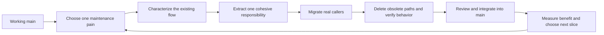

# Exploring possible refactors of tclaude

**Status: exploration — not a decided plan to implement.** This directory
collects possible refactors of tclaude, lessons, diagrams and open questions for
discussion. It does not establish an active roadmap, an approved architecture,
or a commitment to implement any proposal. The `v2` directory name does not
announce a new product version.

Ideas may be changed, rejected or left unexplored. Any work selected for
implementation must be agreed and tracked separately in AWB.

Initial source snapshot: `a976aef8e53788a0a9e78575ffad2346b5df4e63`
(9 September 2026). Re-check current code before starting an increment.

## Purpose

Make ordinary changes cheaper: adding a harness option, changing profile
resolution, fixing a lifecycle bug, or improving a form should not require
rediscovering the same rules in several subsystems. Preserve the working
product while moving each responsibility to one clear owner.

The previous replacement effort produced useful knowledge and tests, but its
architectural milestone did not prove full product coverage. One approach explored
here is to migrate actual callers and remove their old implementations inside
bounded, independently useful changes. That approach is a candidate for discussion.

## Explore the ideas

| Lens | Central question | Document |
|---|---|---|
| Model | What is this thing, who owns it, and how long does it live? | [Model](model.md) |
| Modules | Where is a decision made, and what must not leak out? | [Modules](modules.md) |
| Interfaces | What does a caller need, without knowing the mechanism? | [Interfaces](interfaces.md) |
| Abstractions | Which repeated rules or controls deserve one implementation? | [Abstractions](abstractions.md) |
| Flows | How does a real request cross those boundaries safely? | [Flows](flows.md) |
| Sequence | Which small changes should prove the approach first? | [Iteration strategy](iteration-strategy.md) |
| Evidence | Which current code motivated these proposals? | [Current-state evidence](current-state.md) |
| Decisions | What is settled, proposed, or deliberately unresolved? | [Decision register](decisions.md) |

The five lenses apply to every slice. They are not five phases in which all
models must be rebuilt before any useful behavior can ship.

## Potential high-value directions

1. **Configuration resolution:** centralize precedence, presence and provenance;
   retain differences between ordinary spawn and team-member policies.
2. **Shared UI controls:** consolidate dialogs and input behavior in the existing
   frontend, including boolean/empty/inherit values, focus, hover and scroll styling.
3. **Application actions below transports:** internal scheduling and team code
   should invoke functions, not manufacture HTTP requests and response recorders.
4. **Harness-owned mechanisms:** extend the existing harness seam; remove native
   option interpretation from lifecycle and orchestration callers.
5. **Explicit runtime dependencies and transaction ownership:** replace mutable
   globals along migrated paths, improving isolation and test turnaround.
6. **Lifecycle and observation boundaries:** clarify identities and phase
   transitions incrementally after the smaller seams have proved useful.

Priority reflects change frequency, duplication and rollout risk, not package
size alone. Proposed order is revisable using measured results.

## What lives where

- **Git:** this design, diagrams, decisions, source references and architectural
  tradeoffs. Update them with the code that changes an assumption.
- **AWB:** epics, selected slices, assignees, dependencies, estimates, acceptance
  evidence and delivery status. Do not duplicate that mutable backlog here.
- **Existing user documentation:** authoritative operator behavior. This folder
  must not silently override it.

The operator explicitly authorized this design folder as an exception to the
older convention of keeping all planning outside the repository.

## How to maintain it

Distinguish **current behavior**, **ideas**, **discussion constraints**, and
**unresolved questions**. A recorded preference is not implementation approval.
Keep diagrams honest about whether they describe the present or a target. Each
new proposal needs a current pain, an actual caller, a migration/removal path,
and a way to check the benefit. Once implemented, replace speculative text
with the resulting boundary and link to normal developer documentation.

Do not turn this folder into a detailed implementation diary or another giant
completion ledger. A useful design can stay small while the product remains large.
