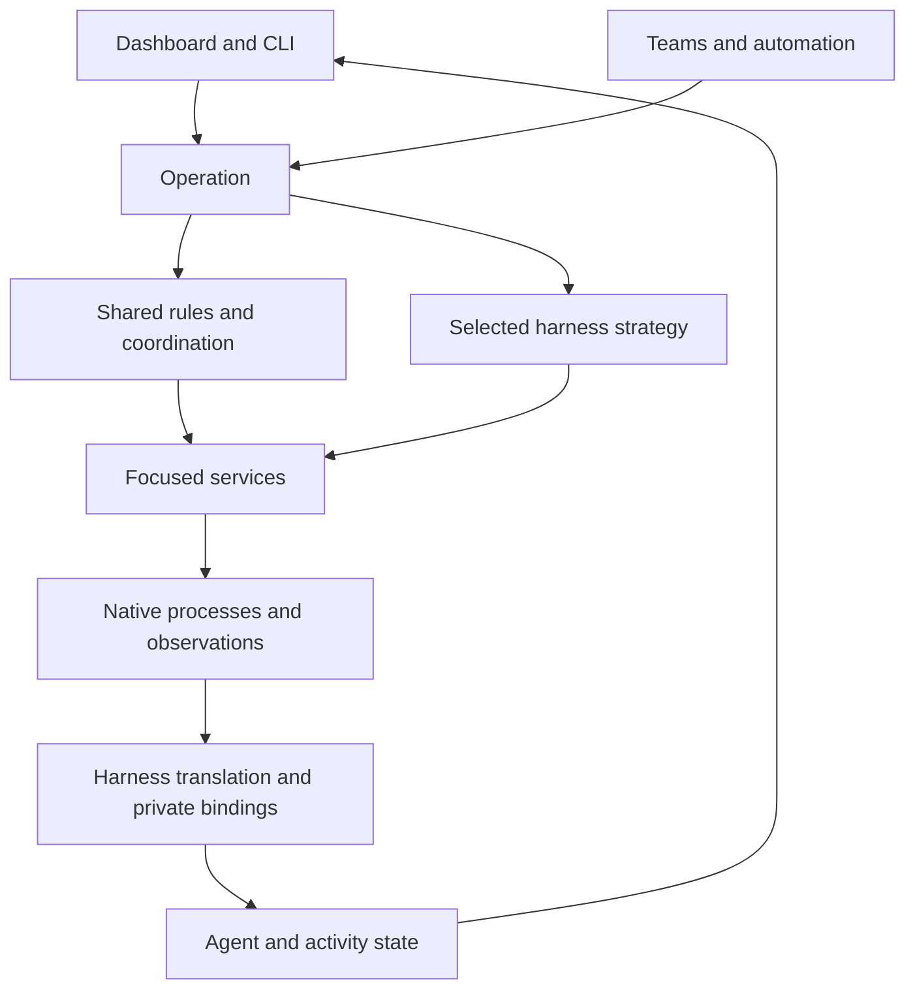
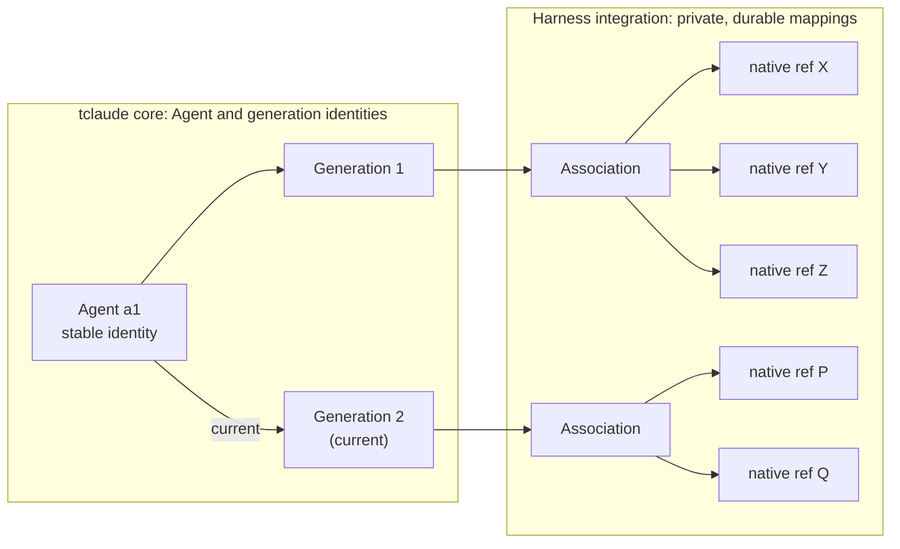

# Exploring operations, services and harness behavior

Preliminary architecture discussion. This is not a decided implementation plan
or guidance for regular feature work. The replacement rewrite remains stopped.

## The idea

**Users work with agents. Operations carry out their requests. Services provide
the mechanisms. Harness strategies handle differences in how the work happens.**

The proposed structure has three main concepts:

1. **The user-facing model:** agents, groups, profiles and work.
   These concepts belong to tclaude. Explicit harness-specific settings remain
   available as extensions; native identifiers and lifecycle quirks do not
   define the core model.
2. **Services:** focused owners of mechanisms such as permissions, configuration,
   native sessions, terminals, message delivery and storage.
3. **Operations:** coordinate services to fulfil a request such as starting,
   restarting or messaging an agent. An operation can delegate part of its
   behavior to a harness-specific strategy.

This can live inside the existing application: a **modular monolith** using
ordinary Go calls. It does not require separate deployments or network services.

The diagram shows proposed responsibilities, not current wiring or a fixed package layout. An operation
may finish immediately or leave work in progress. Harness event handling can
continue after the initiating request returns.

The core begins with **Agent**. An Agent has:

- A stable tclaude identity and a harness ID.
- Intentional **generations**, with a pointer to the current generation.
- For each generation, a harness continuation association owned by the integration.
- Requested and resolved startup configurations of the relevant kinds.
- Last-known extracted metadata: context window, usage, model and other readings.

No separate Conversation, Execution or history-access entity is proposed. Internal
runtime bookkeeping does not automatically become part of the user model.

## Agents, generations and native references

This is the central boundary of the proposal.

The native refs are explanatory integration detail, not core model fields or a
prescribed schema.

- **A generation is a tclaude concept.** It is an intentional stage of an
  Agent's work. It is not a native session or conversation ID, and it is not
  created by each change of that ID.
- **Native ID replacement stays inside a generation.** Claude Code's `/clear`
  and other native replacements are harness-level management concerns. They
  belong in the integration's implementation details and references, not in
  agent-level generations, even when someone types them deliberately. One
  generation may map to several native IDs over time; for another harness it
  may be 1:1.
- **Reincarnation creates a generation.** Intentionally reincarnating an Agent
  is the natural tclaude-level generational change: it creates a new generation
  and moves the current pointer to it once the operation commits. The
  integration implements the native steps.
- **Séance is reincarnation's sister operation.** It is also agent-level and
  follows the same principle: it addresses an earlier generation of the same
  Agent and asks the integration to reach that generation's native
  continuation. It does not change the current generation.
- **Operations name their generation.** Any other operation that addresses
  generations states which one; its contract is defined per operation.
- **Prior associations are kept.** Discovery can then recognise previously
  managed native work instead of presenting every old reference as a new,
  unrelated candidate.
- **Continuity is never guessed.** When the integration cannot establish that
  a native reference continues a generation, it reports the ambiguity. A fork
  and a replacement are not assumed to be the same.
- **Opaque to common logic, not hidden from operators.** Common operations use
  Agent and generation identities and meaningful results, without parsing native
  IDs or history semantics. Native IDs stay available for diagnostics.

Because the integration recognises prior mappings, the core needs no
Conversation or archive entity to track native generations. Conversation
archiving is not part of the future agent-accessible model. Existing commands
and browsing/search behavior remain in main; how they map onto this boundary is
still open.

How configuration and metadata relate to generations (per Agent, per
generation, or both) needs exploration. So do the exact storage and lifetimes.
Try them in a future bounded exercise rather than fixing them here.

Define the tclaude behavior we want first. Each harness integration then fulfils
it, reports a limitation or offers an explicit alternative. The weakest harness
does not set the feature ceiling for the platform.

## Where behavior differs

### Current

| Difference | Where it is handled today |
|---|---|
| Different option or supported feature | Existing profile/configuration code and harness capability definitions |
| Same responsibility, different mechanism | Existing harness adapters together with session and daemon code |
| Different sequence or lifecycle | Existing lifecycle paths and native event handlers; no claim of a uniform operation/strategy structure |

These are broad locations in main, not an assertion that each responsibility
already has one clean owner. See the current tables in the linked pages.

### Future (proposed)

| Difference | Intended place |
|---|---|
| Different option or supported feature | Configuration and capability definitions |
| Same responsibility, different mechanism | Service implementation |
| Different sequence or lifecycle | Harness-specific operation strategy |

Share behavior when its meaning matches. Allow a different sequence when it
does not. Avoid both copying entire operations for every harness and building a
universal flow engine with dozens of hooks and switches.

## Read further

- [User-facing model](model.md): what users see, Agent generations, and what must remain distinct.
- [Operations](operations.md): shared coordination and different native sequences.
- [Services and harness integration](services.md): responsibilities and events.
- [Technical principles](technical-principles.md): relations, composition and behavior interfaces.
- [Design exercise: reincarnate and restart](exercise-reincarnate-restart.md): the first exercise, traced through main.

Start by comparing two real implementations of one operation on main. The
examples here are illustrative, not claims about particular installed harness
versions. Work selection belongs in AWB; these notes do not start implementation.
