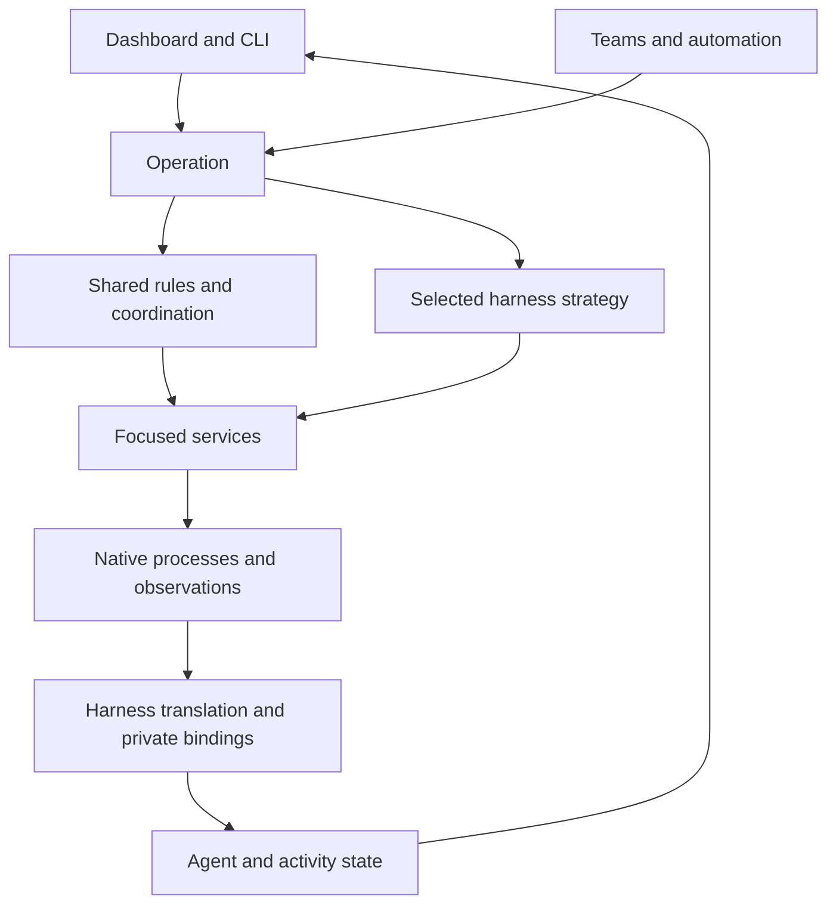

# Exploring operations, services and harness behavior

Preliminary architecture discussion. This is not a decided implementation plan
or guidance for regular feature work. The replacement rewrite remains stopped.

## The idea

**Users work with agents. Operations carry out their requests. Services provide
the mechanisms. Harness strategies handle differences in how the work happens.**

The proposed structure has three main concepts:

1. **The user-facing model:** agents, groups, profiles and work.
   These concepts belong to tclaude. Explicit harness-specific settings remain
   available as extensions; native identifiers and lifecycle quirks do not
   define the core model.
2. **Services:** focused owners of mechanisms such as permissions, configuration,
   native sessions, terminals, message delivery and storage.
3. **Operations:** coordinate services to fulfil a request such as starting,
   restarting or messaging an agent. An operation can delegate part of its
   behavior to a harness-specific strategy.

This can live inside the existing application: a **modular monolith** using
ordinary Go calls. It does not require separate deployments or network services.

The diagram shows proposed responsibilities, not current wiring or a fixed package layout. An operation
may finish immediately or leave work in progress. Harness event handling can
continue after the initiating request returns.

The core begins with **Agent**. An Agent has:

- A harness ID.
- A harness continuation association.
- Requested and resolved startup configurations of the relevant kinds.
- Last-known extracted metadata: context window, usage, model and other readings.

Native continuation references are managed behind the harness interface. No separate
Conversation, Execution or history-access entity is proposed. Internal runtime
bookkeeping does not automatically become part of the user model.

Define the tclaude behavior we want first. Each harness integration then fulfils
it, reports a limitation or offers an explicit alternative. The weakest harness
does not set the feature ceiling for the platform.

## Where behavior differs

### Current

| Difference | Where it is handled today |
|---|---|
| Different option or supported feature | Existing profile/configuration code and harness capability definitions |
| Same responsibility, different mechanism | Existing harness adapters together with session and daemon code |
| Different sequence or lifecycle | Existing lifecycle paths and native event handlers; no claim of a uniform operation/strategy structure |

These are broad locations in main, not an assertion that each responsibility
already has one clean owner. See the current tables in the linked pages.

### Future (proposed)

| Difference | Intended place |
|---|---|
| Different option or supported feature | Configuration and capability definitions |
| Same responsibility, different mechanism | Service implementation |
| Different sequence or lifecycle | Harness-specific operation strategy |

Share behavior when its meaning matches. Allow a different sequence when it
does not. Avoid both copying entire operations for every harness and building a
universal flow engine with dozens of hooks and switches.

## Read further

- [User-facing model](model.md): what users see and what must remain distinct.
- [Operations](operations.md): shared coordination and different native sequences.
- [Services and harness integration](services.md): responsibilities and events.
- [Technical principles](technical-principles.md): relations, composition and behavior interfaces.

Start by comparing two real implementations of one operation on main. The
examples here are illustrative, not claims about particular installed harness
versions. Work selection belongs in AWB; these notes do not start implementation.
