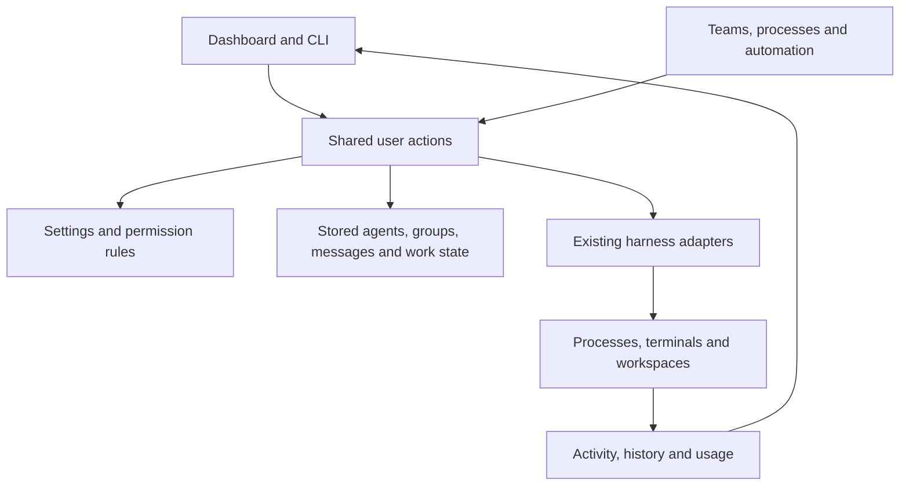

# Exploring a simpler model for tclaude

Preliminary ideas, not a decided implementation plan or guidance for regular work.

## The core

**tclaude lets you organize agents, decide what they can do, give them work,
and follow what happens.**

From the operator's perspective:

- **An agent** is someone you can address, configure, stop, restart and keep
  working with. Its current running session is only how it is working right now.
- **A group** organizes agents that collaborate, with membership, owners and
  shared defaults. An agent can belong to more than one group.
- **Profiles** save settings you want to reuse. Launch profiles choose how an
  agent starts; sandbox profiles describe what it can access.
- **Permissions** say which tclaude actions an agent may perform. Those are
  separate from the files and network its sandbox permits it to access.
- **Templates and automation** repeat work: create a team, follow a process,
  send a scheduled message, or react to an event.
- **Conversations, messages and results** let you see what happened and continue
  working. Terminals are views into live sessions; closing a view is not the
  same as stopping the agent.

Standalone sessions remain useful too. The model must support starting work
without registering an agent, and later promoting that conversation to an agent.

## One example

You deploy a review team into a group. The team template supplies the members,
profiles and briefing. The group supplies applicable defaults. tclaude checks
permissions, starts the agents, and shows their activity and conversations.

You stop and restart the reviewer. It is still the same agent and group member;
the running session changes. You can still find its messages and history. You
can edit a sandbox profile while agents run; editing a saved profile and
changing an already-running process are distinct actions.

A scheduled deployment should call the same deployment behavior as the
operator's button. It should not have another implementation of profile
resolution, membership creation or launching.

## The implementation follows the user model

The proposed architecture is a **modular monolith**: services with clear
responsibilities inside the existing app. Here, a service is ordinary Go code
that owns a set of user actions. Callers use in-process calls; this does not
require separate servers, network APIs or databases.

| Part | What it owns |
|---|---|
| Agents and groups | Create, join, leave, start, stop, restart, retire; identity and membership |
| Settings and permissions | Resolve profiles/defaults, validate choices, decide whether an action is allowed |
| Messaging | Send, store, read and deliver messages and attachments |
| Teams, processes and automation | Remember what work should happen next; invoke the same underlying actions |
| History and reporting | Conversations, activity, usage, results and explanations of failures |

Below those parts, the **existing harness adapters** translate operations into
Claude Code, Codex, OpenCode or Copilot behavior. **Runtime helpers** handle
processes, terminals and worktrees. **Storage** keeps the records and atomic
updates. These are responsibilities to extract gradually, not a demand to
create new packages or replace the database.

The main simplification is **one implementation of each user action**, reused
by all callers. A new profile option should not require a separate rule in
manual spawn, teams, triggers and forms. Where their behavior differs, the
shared code must express that difference explicitly.

## Explore further

- [Model](model.md): the things users work with and what survives each action.
- [Modules](modules.md): which code should own which behavior.
- [Interfaces](interfaces.md): the small calls connecting those responsibilities.
- [Abstractions](abstractions.md): shared rules and UI controls worth extracting.
- [Flows](flows.md): one ordinary scenario through the proposed system.
- [Iteration strategy](iteration-strategy.md): small ways to try this on main.
- [Current evidence](current-state.md): source locations motivating the ideas.
- [Discussion context](decisions.md): preferences and unresolved choices.

Design discussion lives here; actual work items live in AWB. Current operator
documentation remains authoritative. No feature is removed by this sketch.
