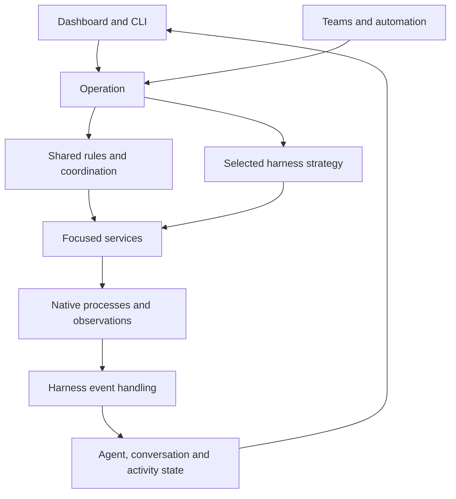

# Exploring operations, services and harness behavior

Preliminary architecture discussion. This is not a decided implementation plan
or guidance for regular feature work. The replacement rewrite remains stopped.

## The idea

**Users work with agents. Operations carry out their requests. Services provide
the mechanisms. Harness strategies handle differences in how the work happens.**

There are three main concepts:

1. **The user-facing model:** agents, groups, profiles, conversations and work.
   These concepts are mostly harness agnostic, with explicit harness-specific
   settings and capabilities where needed.
2. **Services:** focused owners of mechanisms such as permissions, configuration,
   native sessions, terminals, message delivery and storage.
3. **Operations:** coordinate services to fulfil a request such as starting,
   restarting or messaging an agent. An operation can delegate part of its
   behavior to a harness-specific strategy.

This can live inside the existing application: a **modular monolith** using
ordinary Go calls. It does not require separate deployments or network services.

The diagram shows responsibilities, not a fixed package layout. An operation
may finish immediately or leave work in progress. Harness event handling can
continue after the initiating request returns.

## Where behavior differs

| Difference | Proposed place |
|---|---|
| Different option or supported feature | Configuration and capability definitions |
| Same responsibility, different mechanism | Service implementation |
| Different sequence or lifecycle | Harness-specific operation strategy |

Share behavior when its meaning matches. Allow a different sequence when it
does not. Avoid both copying entire operations for every harness and building a
universal flow engine with dozens of hooks and switches.

## Read further

- [User-facing model](model.md): what users see and what must remain distinct.
- [Operations](operations.md): shared coordination and different native sequences.
- [Services and harness integration](services.md): responsibilities and events.

Start by comparing two real implementations of one operation on main. The
examples here are illustrative, not claims about particular installed harness
versions. Work selection belongs in AWB; these notes do not start implementation.
