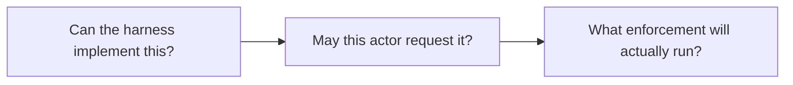

# Abstractions: consolidate repeated meaning

**Proposed direction.** An abstraction earns its place when it removes a rule
that is currently implemented more than once, or makes a dangerous distinction
explicit. Similar-looking syntax alone is insufficient.

## Configuration and capability rules

Reuse the existing harness capability seam. Move native interpretation there
when lifecycle/templates/UI currently duplicate it. A support declaration must
mean the adapter implements the requested behavior, not that it can silently
translate it to a weaker or different option.

Keep three questions separate:

Support is not authority, and authority is not enforcement. The order shown is
conceptual; validation and current-authority rechecks still belong at the
appropriate effect boundary.

## Reusable UI components: early, visible value

Build on the existing Preact/JavaScript components and styling. Do not replace
the frontend to achieve consistency.

| Primitive | Shared behavior | First proof |
|---|---|---|
| Dialog shell | Focus/restore, Escape, stacking, scroll area, pending save and errors | Migrate two existing edit dialogs without changing their layout |
| Optional boolean/select | Absent, explicit false, inherit; unsupported saved values | Save/reopen and clear in two related forms |
| Field row | Label, help, validation and error association | Remove duplicate markup/validation glue |
| Floating help | Placement, viewport clipping, keyboard access and layering | Same behavior in a normal page and a modal |
| Shared style tokens | Scrollbars, hover/focus, disabled/pending and small details | Delete per-view copies after migration |

Separate a feature's payload adapter from a reusable control. A checkbox must
read a boolean; making a generic form renderer mark it required must not make
false impossible to save. Preserve unedited fields and explicit clearing.

Measure the first extraction by migrated call sites and removed duplicate
styles/helpers. A component library with no migrated product views is not a win.
Taste/layout changes remain separate operator decisions.

## Sandbox inheritance: an explicit behavior change

Accepted direction: an agent allowed to spawn should use the same sandbox
configuration, with optional additional deny rules. Operators must remain free
to update profiles while agents run. Profiles are selected by IDs and displayed
by names; no operator-facing hash workflow.

The implementation contract still needs examples for a parent running an older
profile definition while its child starts after an operator edit, composed
profiles/includes, provider-specific native modes and retry versus fresh launch.
Define these before coding; do not infer answers from an old hash comparison.

Move the existing rule behind a focused boundary first if that helps review.
Then change the rule in a separately identified change with operator scenarios.
Remove obsolete inheritance-directory probing; retain checks required for actual
sandbox preparation and enforcement. Do not conflate inherited containment with
permission to spawn or native tool-approval posture.

## Avoid speculative generalization

Do not force schedules, processes and team waves into a new universal engine.
They can share application actions and small mechanisms while retaining their
own semantics. Similarly, ordinary-spawn and team-member precedence can share
primitives without sharing one indiscriminate merge policy.
