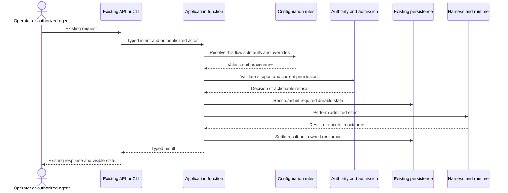

# Flows: migrate behavior end to end

**Proposed migration method.** Every slice follows an existing user action through
its model, owners and effects. The whole application keeps working during the change.

## Launch as a proving flow

This is a target responsibility sequence, not a claim that all current launch
paths already have these stages. Do not hold a SQLite transaction open around
a native process. When retries exist, identify the committed intent before
resolving mutable defaults again. Use existing durable mechanisms first.

## Small scenario matrix per affected flow

| Scenario | Behavior to preserve |
|---|---|
| Ordinary agent creation | Default/profile precedence, task input, labels and permissions |
| Team member launch | Explicit member overrides and team-specific merging |
| Restart/resume | Recorded intent versus freshly resolved editable fields |
| Triggered action | Original actor, capacity/rate limits and current authorization |
| Profile edited during a running agent | Save remains possible; next-launch semantics are explicit |
| Save/retry/conflict | No lost fields or duplicated side effects; useful conflict response |
| Old native event arrives | Cannot change current-attempt authority or liveness |
| Membership removal/rejoin | Membership-scoped metadata has the intended lifetime |

Select the relevant rows for a slice. Do not require every suite for a small
control extraction, and do not use a small suite to claim unrelated parity.

## Cutover and removal

1. Trace current callers and record operator-visible behavior.
2. Add characterization tests around the public path and deterministic policy.
3. Extract the smallest useful shared owner behind the existing entry point.
4. Migrate the next caller while preserving its explicit semantic differences.
5. Remove duplicate code and unused adapters. Verify runtime and data behavior.
6. Review the exact change, integrate, then measure whether it simplified work.

A temporary adapter gets an explicit caller list and removal condition in the
work item. No indefinite second implementation or dual writes. Read-only
shadow comparison can help deterministic resolvers; never shadow-run effects.

## Rollback

Prefer code-only extraction initially. An increment should be revertible without
restoring a replaced database or discarding user-authored fields. If a schema
change becomes necessary, identify old/new reader compatibility and data-preserving
rollback separately. Reverting code does not undo native effects already performed.
