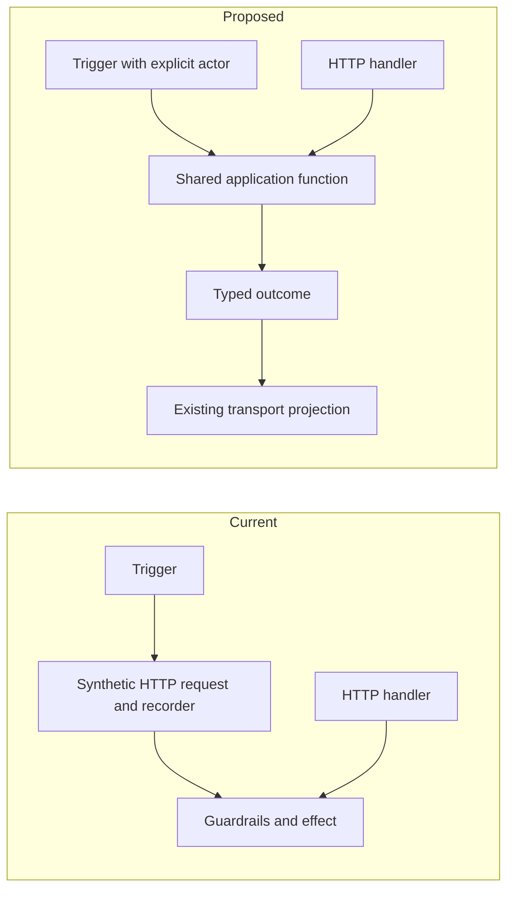

# Interfaces: narrow seams with real callers

**Proposed direction.** Prefer consumer-owned contracts for effects, storage
operations and observations. Pure configuration logic often needs a function,
not a mockable interface.

## Highest-value seams

| Seam | Caller needs | Detail kept behind it |
|---|---|---|
| Resolved launch input | Values, presence decisions and provenance | Traversal of profile/default tiers |
| Application action | Typed request, actor and typed outcome | Transport status codes, JSON encoding |
| Harness operation | Supported native action and result | CLI flags, native files/RPC, harness evidence |
| Focused persistence operation | One meaningful atomic change | SQL tables and transaction plumbing |
| Runtime launcher | Start/resume result and resource ownership | tmux/subprocess invocation |
| Observation reader | Attributed values plus freshness | Native event/file/probe formats |

Names above are conceptual. Reuse existing contracts where they already fit;
introduce a new one only while migrating a real caller.

## First seam: internal orchestration without synthetic HTTP

Current trigger code constructs requests and response recorders to use guardrails.
Extract the shared decision/effect function; both the existing handler and trigger
call it. Keep handler-specific authentication and wire projections at the edge.

The new call must preserve rate limits, capacity checks, permission scopes and
error meaning. A trusted internal caller does not bypass authorization. Passing
an actor explicitly is not the same as manufacturing an operator identity.

## Interface design checks

- At least one real consumer determines the minimal contract; prefer a second
  migrated consumer before calling it shared infrastructure.
- Specify ownership and cancellation of resources returned by an effect.
- Errors distinguish refusal from failure and ambiguous completion where needed.
- Preserve source fields and evidence needed by existing behavior.
- Fake only native boundaries in flow tests; keep production application/storage.
- Avoid a giant Provider, generic CRUD repository, event bus or universal command
  framework merely to make the diagram symmetrical.

The public API need not change when an internal seam improves.
