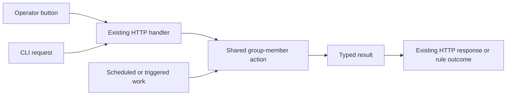

# Interfaces: ordinary requests between parts

An interface should explain a small job in the user's flow. It is not a goal
in itself. Reuse current functions/contracts before inventing new ones.

## Examples of useful boundaries

These names are illustrative, not new public APIs:

| Caller asks | Input it supplies | Result it needs |
|---|---|---|
| Resolve launch settings | Explicit choices, applicable profiles/defaults, flow kind | Settings plus where each came from |
| Start an agent | Caller, agent, task input and launch choices | Started/pending/refused/failed result with a useful explanation |
| Add a group member | Caller, group and member choices | The created membership/agent or refusal |
| Send a message | Caller, recipients, body and attachments | A durable message/delivery result |
| Prepare native launch | Selected settings and required resources | Prepared native input or unsupported/error |
| Store a membership change | Expected state and intended related changes | One atomic result or a conflict |
| Read current activity | Agent/session identity | Status, source and observation time |

A pure settings helper can be a function. A native launcher benefits from an
interface because production starts a process while a flow test substitutes
that external effect. Neither case needs a universal command framework.

## Same action, different entry points

Authentication remains at the entry point. The action receives the actor and
checks authorization; an internal caller does not automatically become an operator.
The handler maps the result to the existing wire response. The rule records the
same result as its own occurrence outcome.

This directly replaces synthetic HTTP calls in internal code. It does not
require changing the public API first.

## What a contract must say

Who may call it? What input is required? What can change? Who owns any created
resource? What happens on cancellation, failure or retry? Which unsupported
cases must be explained?

Answer those for the selected action. Do not introduce generic CRUD repositories,
a giant Provider interface or an event bus just to make every box look alike.
