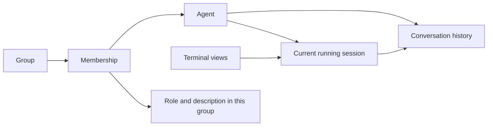

# Model: the things the operator works with

Exploration, not a new database schema. The purpose is to give existing features
clear homes, not to replace them with a smaller feature set.

## Agent, running session and conversation

These answer three different questions:

| Thing | Operator's question | What happens when the agent restarts? |
|---|---|---|
| Agent | Who am I working with? | The agent keeps its identity, memberships and messages. |
| Running session | Where is it running right now? | The old session ends and another can start. |
| Conversation | What has been said and done? | History remains; resume may continue it, while clear/fork has different meaning. |

A terminal pane displays a running session. Several panes may display the same
session. A pane is neither the agent nor its history. A standalone session can
exist without a registered agent. Promotion connects it to an agent identity.

Internally, the harness may rotate its own conversation identifier. That should
not unexpectedly replace the agent or lose its history. Keep the existing
bindings behind a clear API; users need not learn another identity vocabulary.

This is a responsibility sketch, not a declaration of new table cardinalities.
An agent may have several group memberships and past sessions/conversations.

## What the other visible features belong to

| User-visible thing | Meaning | Implementation consequence |
|---|---|---|
| Group | Collaboration space with members, owners and shared settings | Membership changes and group defaults have one owner. |
| Launch profile | Reusable choices for starting work | One place reads the applicable settings and overrides. |
| Sandbox profile | Reusable access restrictions | Editable by ID/name; applied by the sandbox implementation. |
| Permission or permission role | Authority to perform tclaude actions | Checked by the same permission logic for every entry point. |
| Team template | A reusable description of a team | Distinct from the group/agents created by deployment. |
| Process template | A reusable procedure | Distinct from each run and its progress, decisions and results. |
| Schedule, trigger or standing order | A rule for when work should happen | Calls existing actions and records its own progress. |
| Message and attachment | Communication addressed to someone | Stored independently of whether their pane is alive. |
| Workspace | A directory or checkout used for work | Track who is using it before cleanup. |
| Usage and activity | What ran, what it consumed, and what happened | Attributed to the right agent/session/history, with unknown values visible. |

A display role such as “reviewer” describes a member; it is not automatically a
permission grant. A task reference may point to an external tracker. This model
does not require a new internal task-management system.

## Saved settings are not the running process

Users need three understandable views:

1. **Saved settings:** the profile/defaults and explicit choices they can edit.
2. **Settings used to start:** what tclaude selected for a particular launch.
3. **Current status:** what the harness/process reports now.

Those can differ legitimately. Saving a profile must not imply that an existing
process changed, and recording a launch must not prevent later profile edits.
For a fresh launch, use each field's current documented inheritance rule. For a
retry of the same completed request, return its existing outcome.

Defaults also need an explicit “inherit” versus “off” or “clear” distinction.
Keep that meaning through forms, APIs and storage. Do not use a generic merge
that loses intentional empty values or changes team-specific precedence.

## Small invariants with large benefits

- Restart does not accidentally create another agent; cloning can intentionally do so.
- Removing membership does not leave that membership's private role/description behind.
- A template edit and a change to an existing deployment are separate operations.
- An old session's late report cannot become the current agent's status or authority.
- A disconnected terminal does not prove the agent stopped.

These rules guide touched code. They do not require renaming public commands,
converting all records or inventing an immutable version of every user object.
