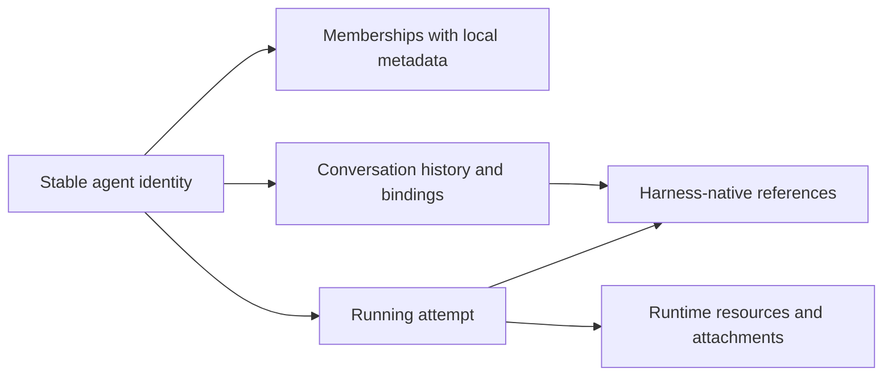
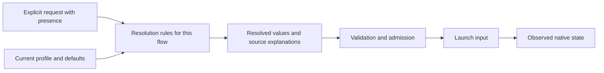

# Model: make meaning and lifetime explicit

**Proposed direction.** Introduce precise types where confusion causes bugs;
keep existing storage and public vocabulary unless a specific change requires more.

## Pillars

| Concept | Why it matters | Incremental approach |
|---|---|---|
| Stable agent identity | A harness conversation ID may change without replacing the agent. | Wrap existing IDs at touched boundaries; preserve historical bindings. |
| Conversation and running attempt | History continuity and one running process have different lifetimes. | Distinguish these in function inputs before introducing any schema change. |
| Membership | Role/description scoped to a group ends with membership. | Keep values on their owning membership; avoid flattening into global agent metadata. |
| Authored, resolved and observed configuration | A saved choice is not proof of what ran. | Separate inputs/results inside one resolver or launch path first. |
| Presence | Absent, false, empty and inherit are different user intentions. | Use explicit presence at decoding boundaries; retain native wire values. |
| Action outcome | Rejected, accepted, running, finished and unknown are different. | Give shared application actions typed outcomes that existing transports can project. |

Conceptual identities below describe responsibilities, not a proposed migration
of every table. The existing model already contains parts of these distinctions.

A native reference is an adapter-owned identifier. It must not become the
source of platform authority merely because a message contains that string.
Do not invent a persistent Session just to rename current commands.

## Configuration is a pipeline, not a universal bag of fields

The same resolver machinery may serve different precedence policies. For
example, ordinary spawn's selected permission map and a team member's per-action
overrides must not be collapsed into one generic merge operation. Startup
context is reusable guidance; an initial message is task input. Persisting both
in the same blob does not make their override semantics identical.

A lifecycle classification table should accompany each migrated field:

| Field kind | Example | Required question |
|---|---|---|
| Current named selection | Sandbox profile ID | Which current definition applies to a fresh launch? |
| Authored optional choice | Explicit false / inherit | Can the caller intentionally clear the default? |
| Recorded execution input | Native options actually launched | What remains available for diagnosis and retry? |
| Live observation | Activity/context usage | How fresh is it and which running attempt reported it? |

Recording past inputs must not freeze editable operator profiles. Exact retry
and a genuinely new launch also need distinct rules; do not resolve new defaults
and then claim to replay a past operation.

## First useful extraction

Characterize one existing scalar/boolean option through direct spawn and team
launch. Extract presence and source attribution, migrate both callers, and
remove their duplicate selection code. Keep policy differences explicit. Extend
the field set only after that seam reduces actual maintenance work.

**Avoid:** replacing all database records with a lightweight idealized model,
mechanically introducing IDs everywhere, or dropping inconvenient fields to fit
a smaller schema. See [current evidence](current-state.md).
