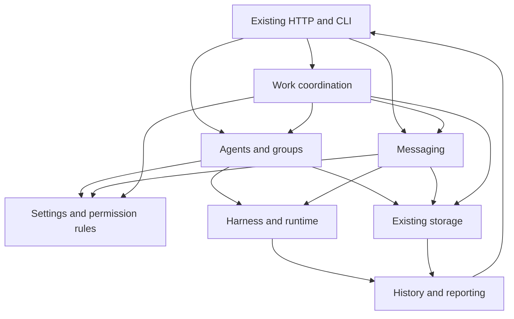

# Architecture: put each user action in one place

The proposed structure is a **modular monolith**: services organized around
what users do, running inside the existing app. A service owns behavior and
exposes ordinary Go functions or methods to its callers. It can begin inside
existing packages; package moves are optional.

For example, the group service owns adding a member. The dashboard handler,
CLI path and team coordinator ask it to do that work; they do not each recreate
its rules. The service uses settings, permission and launch operations where
needed. Related database updates can still share a transaction.

Separate deployment is not a goal of this proposal. Choose boundaries that
make today's app easier to understand and change, without adding network calls
or serialization between its internal services.

## Five areas of behavior

| Area | Example calls | Owns | Delegates |
|---|---|---|---|
| Agents and groups | Create agent, add member, restart agent, disband group | Identity, membership and lifecycle decisions | Profile lookup, permission checks and native launch |
| Settings and permissions | Save profile, resolve launch settings, check action | Meaning of settings and permission rules | Data reads/writes; native option validation |
| Messaging | Send message, read inbox, acknowledge | Addressing, storage and delivery outcomes | Harness-specific wakeup/input mechanism |
| Work coordination | Deploy team, advance process, run schedule | Template/rule interpretation and progress | Agent, group and message actions |
| History and reporting | Read conversation, inspect work, show usage/logs | Attributed information and its freshness | Native collection and persisted records |

The names are descriptive. They are not a proposed five-interface framework or
five new databases. Existing processes and automation need not become one engine.

## Three implementation details below them

**Harness adapters** know how Claude Code, Codex, OpenCode and Copilot behave:
flags, files, APIs, supported options, message input and native observations.
Main already has this boundary; extend and use it consistently.

**Runtime helpers** manage processes, terminals, worktrees and sandbox mechanisms.
They should not decide whether a group owner may spawn another agent.

**Storage operations** own related database changes and transaction boundaries.
They should not spawn a process inside an open SQL transaction. Keep existing
SQLite tables and records unless a selected change demonstrates a reason to alter them.

This shows calls and information movement, not package imports. Each entry
point authenticates its caller; internal automation retains its actual actor.

## How this removes complexity

Today, a trigger creates HTTP request/response objects to use guardrails. It
could call the same application function as the handler. That removes transport
plumbing without changing the guardrail.

A profile option already has shared scalar/boolean resolvers. The useful next
step is to give those rules a clearer owner and remove only demonstrated
remaining duplication—not write another resolver.

A shared action can receive its spawner explicitly. Its tests then do not need
to change a package-global spawner. The daemon can own that dependency while
older callers temporarily keep their existing facade.

Reporting should read status. Collection and repair should happen in an explicit
worker or refresh action, rather than as a side effect of constructing a row.
Preserve the old freshness behavior when moving that work.

Success means fewer places need to change for a user feature. Smaller files,
more interfaces, or moving everything under new package names do not prove it.
