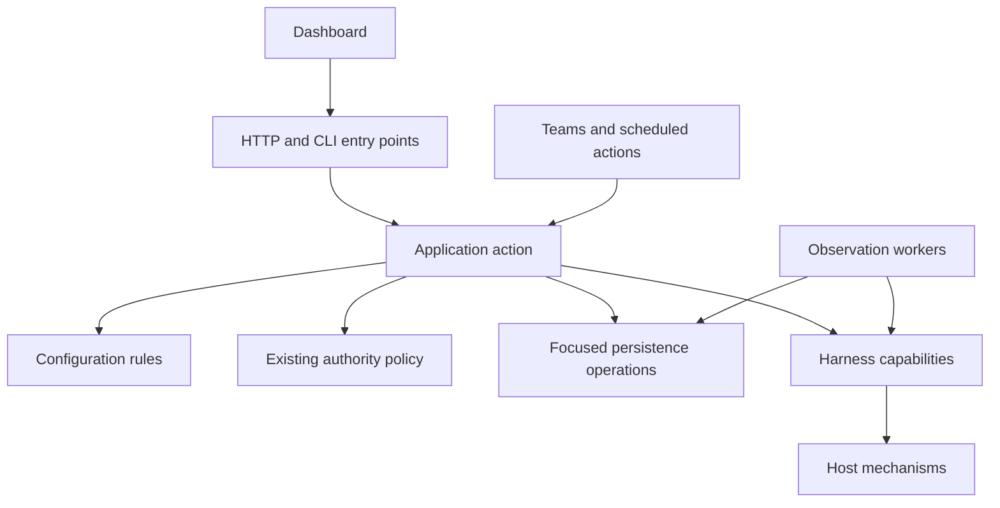

# Modules: one owner for each decision

**Proposed ownership map, not a package rename plan.** Existing `harness`, DB,
CLI and dashboard modules are assets to improve. A directory move without fewer
cross-boundary decisions is not success.

| Owner | Responsibility | Should not own |
|---|---|---|
| Configuration resolution | Presence, precedence, defaults, source attribution | Native process preparation or HTTP responses |
| Application actions | Authenticated actor, policy ordering, operation orchestration | Constructing HTTP requests for internal callers |
| Harness adapters | Native flags/settings, APIs, evidence interpretation, capability contracts | Group ownership or global permission decisions |
| Host/runtime resources | Processes, terminal attachment, worktrees and cleanup | Profile precedence or business authorization |
| Persistence | Atomic writes, revision checks, existing data mappings | Launching processes while a transaction is open |
| Observation | Collection, attribution, freshness and reconciliation | UI rendering as a trigger for durable repair |
| Frontend feature modules | Operator intent and display | Reimplementing backend authority/default precedence |
| Shared frontend controls | Input semantics, accessibility, styling and dialog lifecycle | Feature-specific save policy |

Target dependency direction for a migrated flow:

This does not mandate new top-level packages for every box. Begin with cohesive
functions inside current packages; move a boundary when its dependencies are clear.

## Runtime ownership and globals

The current global spawner makes unrelated tests share mutable state. Inject it
into the first extracted action rather than rewriting the entire daemon's
construction at once. The compatibility facade may temporarily use a default
instance; all migrated callers and their tests must use their own instance.
Remove the facade when its last caller moves.

Apply the same approach to selected database, clock and native-command
boundaries. Do not add an interface for every standard-library call.

## Observation is work; rendering is a read

The dashboard row cache currently includes a context-write flush path. First
characterize who depends on that freshness, then move collection/writes behind
an existing worker or explicit refresh operation. Do not merely delete writes
and leave stale UI. Unknown and stale values should remain distinguishable
from idle, zero and completed.

## Reduction test

For a representative option or action, count how many modules must understand
its policy before and after extraction. A successful module boundary reduces
that count and removes an obsolete implementation. Test isolation and reduced
change fan-out matter more than a smaller largest file.
