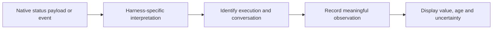

# Services and harness integration

A service owns a focused mechanism and its rules. An operation coordinates
those mechanisms for a user request. A service may itself expose substantial
behavior; the distinction is responsibility, not function size.

Possible services include:

| Service | Responsibility |
|---|---|
| Configuration | Resolve explicit choices, profiles and defaults with their meaning intact |
| Permissions | Decide whether an actor may perform an action under current rules |
| Native session | Launch, resume or communicate with native execution where supported |
| Terminal and workspace | Manage terminal views, processes and working resources |
| Conversation tracking | Associate native conversations and observations with tclaude identities |
| Messaging | Store, address and track message delivery |
| Persistence | Commit related application state changes consistently |

This is a vocabulary for discussion, not a mandatory package or interface for
every row. Main already has harness abstractions and shared configuration
helpers; reuse them rather than introducing a parallel framework.

## A harness integration is more than a function adapter

It may own native configuration validation, command construction, protocol
handling, lifecycle state and asynchronous observation processing. Some work
happens in response to an operation; other work happens because the native
harness reports a change.

For example, a context observation can arrive independently of any user action:

The integration understands what the native payload means. Shared tracking
services provide the associations and update rules. Unknown correlations must
not be guessed into the current session. Depending on the native protocol,
handling may require waiting for identity information or exposing unavailable
state; that behavior belongs in the integration's contract.

## Where a strategy belongs

An operation selects the harness behavior it needs. The harness-specific strategy
can live alongside its integration and use that integration's mechanisms. The
application owns the common operation contract; the harness owns its native
sequence. Keep the dependency direction explicit when choosing packages.

Not every harness must implement every capability. Use focused contracts with
meaningful unsupported outcomes, rather than one enormous interface padded
with no-op methods.

## Keep the boundaries useful

A good service contract states what it accepts, what it can change and what its
result means. It should not expose a harness's incidental sequence as a rule
for all callers. Conversely, it should not erase a difference the operation
needs to handle.

Prefer direct calls and explicit dependencies within the single app. Event
handling does not require a new event bus. Test the operation through existing
public flows, and test native sequences and event interpretation at the harness
boundary. A successful extraction makes behavior easier to locate and change;
more layers alone are not progress.
