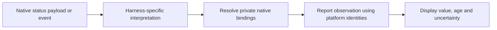

# Services and harness integration

In the proposed architecture, a service owns a focused mechanism and its rules. An operation coordinates
those mechanisms for a user request. A service may itself expose substantial
behavior; the distinction is responsibility, not function size.

## Current

These are implementation areas, not services already extracted on main.

| Responsibility | Current location or form |
|---|---|
| Configuration | Shared resolution helpers and flow-specific handling in daemon lifecycle and team/template code |
| Permissions | Existing access checks used by daemon actions |
| Native execution | Existing harness abstractions, spawners and lifecycle handling |
| Terminal and workspace | Existing tclaude session/window, tmux and worktree code |
| Identity and conversation tracking | Agent/conversation mappings, tclaude session records and native event handling |
| Messaging | Existing daemon mailbox and harness delivery paths |
| Persistence | Existing SQLite operations, used by application paths |

Examples: [daemon lifecycle](../../pkg/claude/agentd/lifecycle.go),
[team templates](../../pkg/claude/agentd/templates.go),
[harness boundary](../../pkg/claude/harness/harness.go), and
[database code](../../pkg/claude/common/db/).

## Future (proposed)

| Service responsibility | Intended boundary |
|---|---|
| Configuration | Resolve explicit choices, profiles and defaults with their meaning intact |
| Permissions | Decide whether an actor may perform an action under current rules |
| Native execution | Launch, resume or communicate with native execution where supported; do not call this tclaude's session/window model |
| Terminal and workspace | Manage tclaude windows, terminal views and working resources with explicit lifetimes |
| Agent identity and associations | Own Agent identity and harness selection; delegate opaque continuation state and native bindings to the integration |
| Messaging | Store, address and track message delivery |
| Persistence | Commit related application state changes consistently |

This is a vocabulary for discussion, not a mandatory package or interface for
every row. Main already has harness abstractions and shared configuration
helpers; reuse them rather than introducing a parallel framework.

## Proposed harness integration: more than a function adapter

It may own native configuration validation, command construction, protocol
handling, lifecycle state and asynchronous observation processing. Some work
happens in response to an operation; other work happens because the native
harness reports a change.

For example, a context observation can arrive independently of any user action:

The integration understands native payloads, ID changes and their lifecycle
meaning. It owns private bindings from native references to platform identities,
including persisted bindings when recovery requires them. Shared services own
Agent records; they do not model or read native chat history. Native duplication
or continuation needed by clone and reincarnate stays inside the integration.
Unknown correlations must not be guessed into the current execution.

The boundary exposes platform operations and meaningful outcomes, not native
protocol details. An integration can report that continuation is unavailable or
an observation is incomplete without requiring a common service to inspect a
Claude session ID or a Codex-specific event. Native diagnostic information can
remain accessible separately.

## Where a strategy belongs

An operation selects the harness behavior it needs. The harness-specific strategy
can live alongside its integration and use that integration's mechanisms. The
application owns the common operation contract; the integration owns its native
sequence, private bindings and translation into platform outcomes. Keep the dependency direction explicit when choosing packages.

The desired operation contract comes first; do not reduce it to the capabilities
common to all harnesses. Not every harness must implement every capability. Use focused contracts with
meaningful unsupported outcomes, rather than one enormous interface padded
with no-op methods.

## Keep the boundaries useful

A good service contract states what it accepts, what it can change and what its
result means. It should not expose a harness's incidental sequence as a rule
for all callers. Conversely, it should not erase a difference the operation
needs to handle.

Prefer direct calls and explicit dependencies within the single app. Event
handling does not require a new event bus. Test the operation through existing
public flows, and test native sequences and event interpretation at the harness
boundary. A successful extraction makes behavior easier to locate and change;
more layers alone are not progress.
