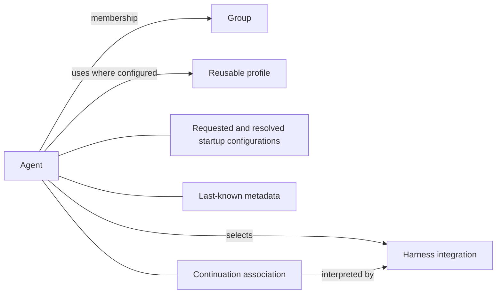

# Technical principles: relations and composition

These choices come after the user model and operation boundaries. This page is
exploration, not an instruction to introduce a framework or rewrite main.

The starting preference is **relations between concepts, composition within
concepts, and interfaces where behavior varies**.

## Current

| Technique | Current position |
|---|---|
| Relations | SQLite already relates agents, conversation associations, groups and memberships. Existing relationships are a starting point, not a clean implementation of the proposed model. |
| Composition | Go structs already group configuration and runtime data; ownership and lifetimes have accumulated across those structures. |
| Interfaces and object-style organization | Harness interfaces and methods already exist alongside package functions and shared state. There is no need to invent the harness boundary from scratch. |
| Inheritance | Go has no class inheritance; existing harness differences do not require an Agent subclass hierarchy. |
| Entity-component-system (ECS) | The inspected main structures are ordinary Go and SQLite records, not evidence of a general ECS architecture. |

Examples: [agent records](../../pkg/claude/common/db/agents.go),
[session records](../../pkg/claude/common/db/sessions.go), and
[harness interfaces](../../pkg/claude/harness/harness.go).

## Future (proposed)

| Technique | Intended use |
|---|---|
| Relations | Connect concepts that have their own identities or lifetimes: Agent to Group, selected harness and reusable Profile. Make membership and association meaning explicit. |
| Composition | Assemble Agent state from configuration, continuation association and last-known metadata, without requiring subclasses for each combination. |
| Interfaces and object-style organization | Use focused service/strategy contracts for varying behavior. Methods can keep state and rules together; pure transformations can remain functions. |
| Inheritance | No proposed domain inheritance hierarchy. Different strategy implementations satisfy a contract; they are not different subclasses of Agent. |
| Entity-component-system (ECS) | Not proposed as a framework. Optional composed data does not by itself justify component registries, dynamic entity queries or system scheduling. Revisit only for a concrete need. |

These techniques solve different problems and can coexist. Choosing relations
as the central modeling tool does not mean every field becomes a separate table.

## Relations connect things; composition describes their parts

A group is not a kind of agent, and an agent does not contain a harness. An
agent belongs to groups and selects a harness. Those are relations.

Requested configurations and observed metadata describe parts of an agent's
state. Those are useful composition boundaries, even if their storage is split
for practical reasons.

Membership can have its own attributes, such as a group-specific display role.
Those attributes belong to the relationship, not globally to either endpoint.
Their lifetime should follow that membership. This is a concrete reason to model
relations explicitly rather than hiding them in loosely related fields.

This is a proposed conceptual sketch, not a table schema or a claim about all
cardinalities. The harness may be a registered implementation identified by a
key, not a database entity. Its private continuation state remains opaque to
common operations. No chat-history entity is implied.

## Specify a relation before choosing its representation

For each relationship, answer:

- What does it mean, and can either side exist independently?
- Is it one-to-one, one-to-many or many-to-many?
- Which side owns changes, and who may make them?
- Does it have attributes of its own?
- What happens when a member leaves, an object is removed, or a selection changes?
- Is it a reference to current settings or a record of settings used earlier?

For example, a selected profile can change while an agent runs. That selection
and the resolved configuration used at startup have different meanings. Do not
make one ambiguous relation serve both purposes or prevent profile updates to
avoid answering the distinction.

Changing an agent's harness selection also needs an explicit operation contract:
continuation state for one integration cannot simply be handed to another.
That does not require inventing a universal history-conversion model.

## Compose data without creating a bag of arbitrary components

Prefer explicit typed parts for known concepts. A requested configuration,
resolved configuration and metadata reading should not become interchangeable
maps just because all contain a model name.

Composition does not require a generic component framework. Nor does it require
everything associated with an agent to be loaded, locked or saved together.
Choose those boundaries from consistency and access needs.

Harness-specific settings remain possible. Their definitions and validation
belong to the integration; common code preserves intent without accumulating
harness-specific conditionals throughout the Agent model.

## Interfaces express contracts, not taxonomies

An Agent remains an Agent regardless of its harness. The selected strategy
implements the native part of an operation and delegates to services. Stateful
integration objects can manage native lifecycle events and private bindings.
Shared code consumes meaningful results rather than knowing their native types.

Use an interface when alternate implementations or an external effect justify
it. Keep straightforward calculations as functions. Go embedding may help reuse
small pieces, but it should not become a hidden inheritance hierarchy whose
promoted methods obscure which implementation runs.

## Domain relations are not automatically database relations

A relation might be represented by a typed ID, a membership row, a registry key
or an association owned by an integration. Choose storage after the meaning is
clear. SQL constraints and transactions can enforce durable relationships;
ordinary Go types and methods express them in code. Neither replaces the other.

Before adopting a pattern broadly, model one real operation and its data changes.
Check whether the chosen representation makes ownership, variation and updates
easier to understand. The objective is fewer ambiguous concepts and fewer places
to change for a feature, not a uniform style imposed on every part of the app.
